# AI Agent 开发范式转移：从手写代码到声明式定义

> 一份关于 2023–2026 年 Agent 开发模式演变的技术综述。覆盖 17 篇论文（含 5 篇顶级会议论文）、5 个行业标准、Agent Harness 运行时引擎、主流工具与代码库。含各论文/规范的权威性评估与落地状态评估。

---

## 目录

1. [引言：一个根本性的转变](#1-引言一个根本性的转变)
2. [第一阶段：代码优先时代（2023–2024）](#2-第一阶段代码优先时代20232024)
3. [第二阶段：声明式定义崛起（2025 Q1–Q3）](#3-第二阶段声明式定义崛起2025-q1q3)
   - 3.5 [Agent Harness：声明式定义的运行时引擎](#35-agent-harness声明式定义的运行时引擎)
4. [第三阶段：标准化与互操作（2025 Q4–2026）](#4-第三阶段标准化与互操作2025-q42026)
5. [学术论文综述](#5-学术论文综述)
   - 5.4 [学术论文 vs 工业落地的现实差距](#54-学术论文-vs-工业落地的现实差距)
6. [工业标准与协议全景](#6-工业标准与协议全景)
7. [工具与代码库](#7-工具与代码库)
8. [范式对比矩阵](#8-范式对比矩阵)
9. [未来展望](#9-未来展望)
10. [参考文献](#10-参考文献)

---

## 1. 引言：一个根本性的转变

2025 年 12 月，Anthropic 发布工程博文《Building Effective Agents》，明确提出核心设计哲学："Start with the simplest solution possible, and only increasing complexity when needed."[[14]](#ref-14) 这一观点浓缩了 Agent 开发领域正在经历的深层转变——从手写数百行控制流代码，到用声明式配置描述 Agent 应该做什么。

**问题的本质**：

在 2023–2024 年，构建一个 AI Agent 意味着用 Python 编写数百行代码——定义状态图、配置工具调用、处理错误恢复、管理上下文窗口。LangChain 和 LangGraph 是这一时期的代名词。

到 2026 年，构建一个 AI Agent 可以只是写一个 YAML 文件，或者在一个 Markdown 文件里用自然语言描述它的职责：

```yaml
# 2026 年的 Agent "代码"
name: code-reviewer
description: Expert code review. Use after code changes.
tools: [Read, Grep, Glob]
model: claude-sonnet-4-6
---
You are a senior code reviewer. Analyze for correctness, security, and performance.
```

这个转变的意义不亚于从汇编语言到高级语言、从手动配置服务器到 Infrastructure-as-Code 的跃迁。本文系统梳理这一转变的技术脉络、关键论文、工业标准和代表性工具。

**核心论点**：

Agent 开发正经历从 **"写代码描述如何做"**（Imperative）到 **"写配置描述要什么"**（Declarative）的范式转移。这一转移由四个因素驱动：(1) 模型能力的跃升——Agent 不再需要精细的逐步指令；(2) 工具生态的成熟——MCP、Skills、Hooks 提供了标准化的能力接入；(3) 标准化的需求——当每个框架都用自己的方式定义 Agent，互操作成为瓶颈；(4) Agent Harness 的成熟——将声明式定义从"配置文件"变为"可运行系统"的运行时引擎成为竞争焦点。

**范式转移全景时间线**：

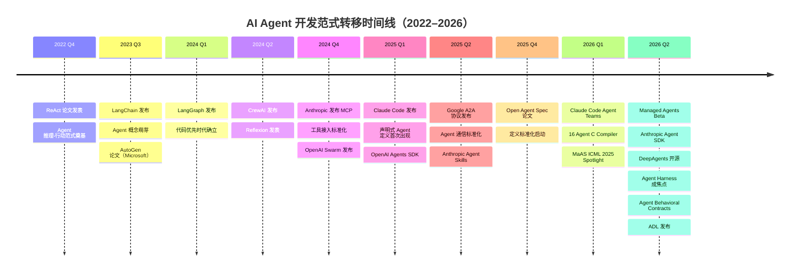
```mermaid
timeline
    title AI Agent 开发范式转移时间线（2022–2026）
    2022 Q4 : ReAct 论文发表
            : Agent 推理-行动范式奠基
    2023 Q3 : LangChain 发布
            : Agent 概念萌芽
            : AutoGen 论文（Microsoft）
    2024 Q1 : LangGraph 发布
            : 代码优先时代确立
    2024 Q2 : CrewAI 发布
            : Reflexion 发表
    2024 Q4 : Anthropic 发布 MCP
            : 工具接入标准化
            : OpenAI Swarm 发布
    2025 Q1 : Claude Code 发布
            : 声明式 Agent 定义首次出现
            : OpenAI Agents SDK
    2025 Q2 : Google A2A 协议发布
            : Agent 通信标准化
            : Anthropic Agent Skills
    2025 Q4 : Open Agent Spec 论文
            : 定义标准化启动
    2026 Q1 : Claude Code Agent Teams
            : 16 Agent C Compiler
            : MaAS ICML 2025 Spotlight
    2026 Q2 : Managed Agents Beta
            : Anthropic Agent SDK
            : DeepAgents 开源
            : Agent Harness 成焦点
            : Agent Behavioral Contracts
            : ADL 发布
```

**四大驱动因素**：

Agent 范式转移由四个相互关联的因素共同驱动：

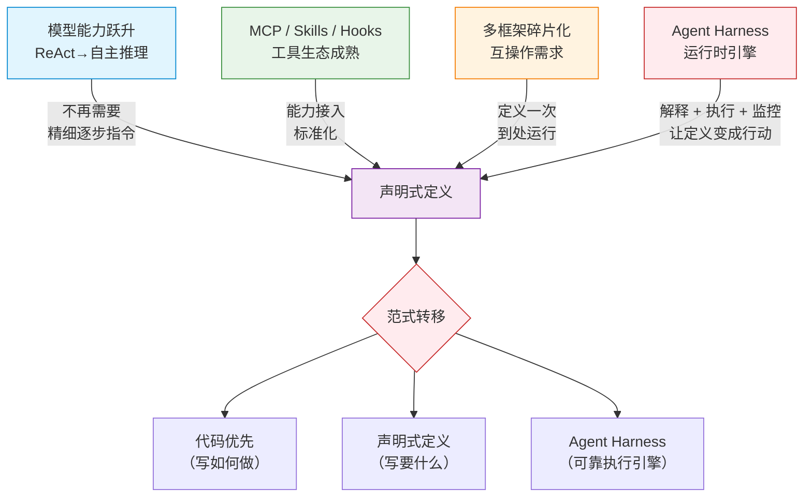
```mermaid
flowchart TD
    A[模型能力跃升<br/>ReAct→自主推理] -->|"不再需要<br/>精细逐步指令"| D[声明式定义]
    B[MCP / Skills / Hooks<br/>工具生态成熟] -->|"能力接入<br/>标准化"| D
    C[多框架碎片化<br/>互操作需求] -->|"定义一次<br/>到处运行"| D
    H[Agent Harness<br/>运行时引擎] -->|"解释 + 执行 + 监控<br/>让定义变成行动"| D
    D --> E{范式转移}
    E --> F["代码优先<br/>（写如何做）"]
    E --> G["声明式定义<br/>（写要什么）"]
    E --> H2["Agent Harness<br/>（可靠执行引擎）"]
    
    style A fill:#e1f5fe,stroke:#0288d1
    style B fill:#e8f5e9,stroke:#388e3c
    style C fill:#fff3e0,stroke:#f57c00
    style H fill:#ffebee,stroke:#c62828
    style D fill:#f3e5f5,stroke:#7b1fa2
    style E fill:#ffebee,stroke:#c62828
```

---

## 2. 第一阶段：代码优先时代（2023–2024）

### 2.1 特征

在这个阶段，Agent 本质上是一个由开发者手写的控制流程序，LLM 只是流程中的一个推理组件。其理论基础来自 2022 年 Yao 等人发表的 **ReAct** 论文——该论文提出将推理（Reasoning）与行动（Acting）交织的范式，被 **ICLR 2023** 接收 [[1]](#ref-1)，成为整个 Agent 领域的基石工作。

**代码优先 Agent 的运行时循环**：

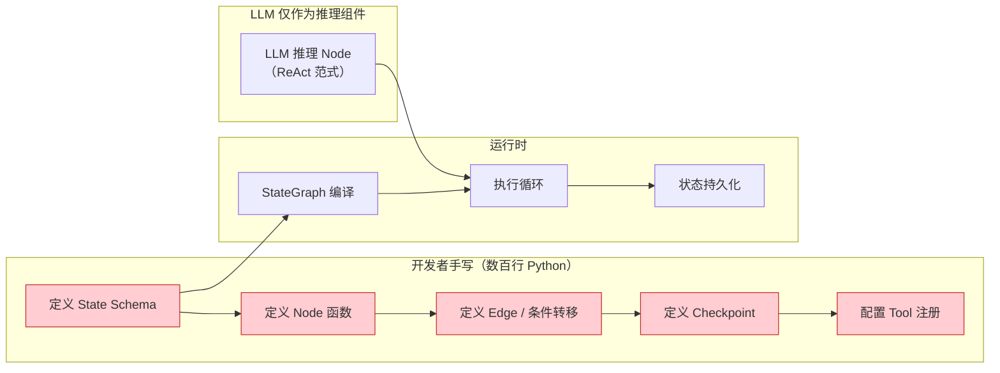
```mermaid
flowchart LR
    subgraph "开发者手写（数百行 Python）"
        A[定义 State Schema] --> B[定义 Node 函数]
        B --> C[定义 Edge / 条件转移]
        C --> D[定义 Checkpoint]
        D --> E[配置 Tool 注册]
    end
    
    subgraph "LLM 仅作为推理组件"
        F["LLM 推理 Node<br/>（ReAct 范式）"]
    end
    
    subgraph "运行时"
        G[StateGraph 编译] --> H[执行循环]
        H --> I[状态持久化]
    end
    
    A --> G
    F --> H
    
    style A fill:#ffcdd2,stroke:#c62828
    style B fill:#ffcdd2,stroke:#c62828
    style C fill:#ffcdd2,stroke:#c62828
    style D fill:#ffcdd2,stroke:#c62828
    style E fill:#ffcdd2,stroke:#c62828
```

**ReAct 循环——从理论到工程**：

ReAct 论文 [[1]](#ref-1) 的核心贡献是确立了 **Thought → Action → Observation** 的三元循环。这个循环后来被 LangChain、LangGraph 等框架直接实现为 Agent 执行引擎的骨架：

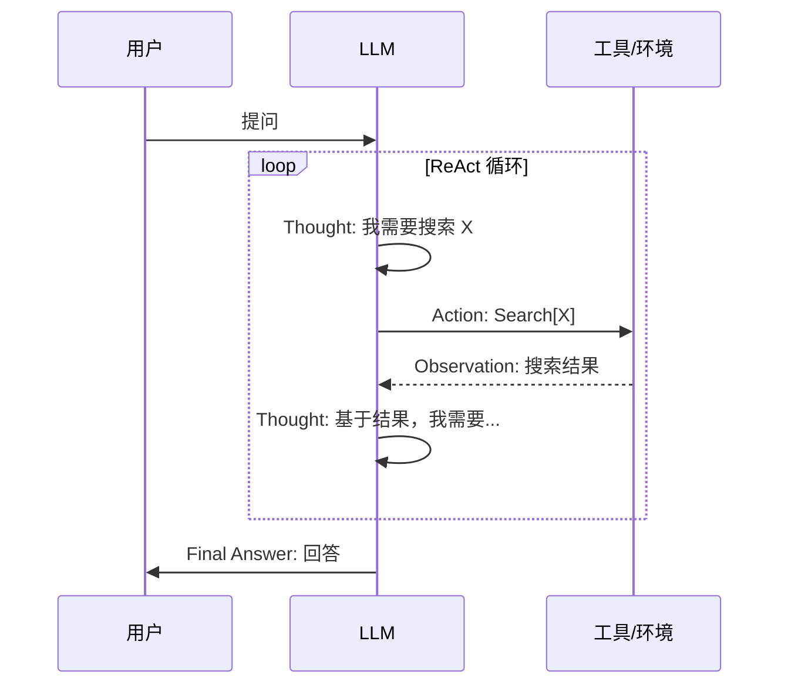
```mermaid
sequenceDiagram
    participant U as 用户
    participant L as LLM
    participant T as 工具/环境
    
    U->>L: 提问
    loop ReAct 循环
        L->>L: Thought: 我需要搜索 X
        L->>T: Action: Search[X]
        T-->>L: Observation: 搜索结果
        L->>L: Thought: 基于结果，我需要...
    end
    L->>U: Final Answer: 回答
```

**典型架构**：

```python
# LangGraph 代码示例（2024）
from langgraph.graph import StateGraph, END
from typing import TypedDict

class AgentState(TypedDict):
    messages: list
    next_step: str
    tool_results: dict

graph = StateGraph(AgentState)

# 手动定义每个节点
graph.add_node("agent", agent_node)        # LLM 推理
graph.add_node("tools", tool_executor)      # 工具执行
graph.add_node("reviewer", review_node)     # 结果审查

# 手动定义每条边和条件
graph.add_conditional_edges("agent", router, {
    "call_tool": "tools",
    "finish": END
})
graph.add_edge("tools", "agent")

# 手动配置检查点和状态
app = graph.compile(checkpointer=SqliteSaver(...))
```

### 2.2 代表性框架

#### LangGraph（LangChain 生态）

LangGraph 将 Agent 工作流建模为**有向状态图**，开发者通过 Python 代码显式定义节点（Agent/工具/函数）、边（条件转移/循环）、共享状态和检查点。

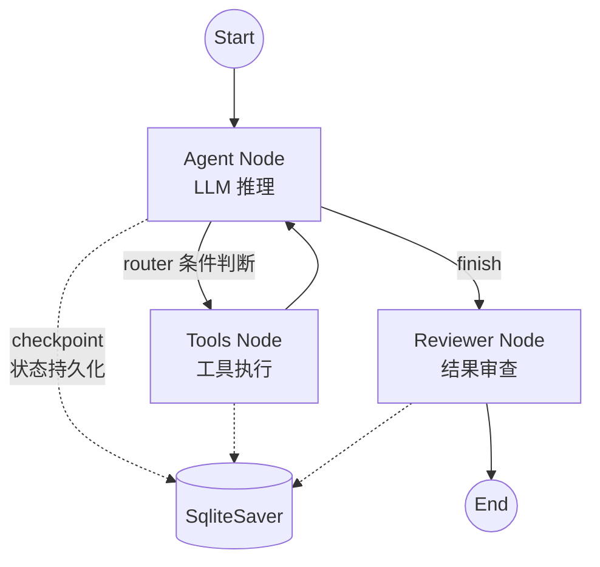
```mermaid
flowchart TD
    START((Start)) --> agent[Agent Node<br/>LLM 推理]
    agent -->|"router 条件判断"| tools[Tools Node<br/>工具执行]
    tools --> agent
    agent -->|"finish"| review[Reviewer Node<br/>结果审查]
    review --> ENDD((End))
    
    agent -.->|"checkpoint<br/>状态持久化"| DB[(SqliteSaver)]
    tools -.-> DB
    review -.-> DB
```

**优势**：精确的控制流、持久化状态、生产级的可观测性（LangSmith）。

**代价**：每个 Agent 需要数百行 Python 代码，节点/边定义的认知负担高，修改 Agent 行为需要改代码重新部署。

#### CrewAI

CrewAI 采用了角色化隐喻——定义 Agent（角色 + 背景 + 目标）、Task、Crew。虽然概念层次比 LangGraph 高，但仍然需要通过 Python API 编写：

```python
from crewai import Agent, Task, Crew

architect = Agent(role="系统设计师", goal="设计 API 架构", ...)
coder = Agent(role="后端开发者", goal="实现 API", ...)
tester = Agent(role="测试工程师", goal="编写测试", ...)

crew = Crew(agents=[architect, coder, tester], tasks=[...], process=Process.hierarchical)
result = crew.kickoff()
```

**优势**：基于角色的抽象，学习曲线低。

**代价**：仍然需要写 Python，难以与非 Python 生态集成，部署依赖特定运行时。

#### AutoGen（Microsoft Research）

Microsoft Research 于 2023 年发表的 AutoGen [[2]](#ref-2) 是对话式多 Agent 框架。Agent 通过消息在群聊中通信。灵活但不稳定——对话循环缺乏确定性。

**论文信息**：arXiv 2308.08155，作者包括 Qingyun Wu、Gagan Bansal、Jieyu Zhang 等，来自 Microsoft Research、Penn State University、University of Washington。

#### Reflexion：自反思 Agent

Shinn 等人于 2023 年发表的 Reflexion [[3]](#ref-3) 引入了**语言化的强化学习**——Agent 通过自然语言自反思进行试错学习，无需更新模型权重。该工作在 NeurIPS 2023 Workshop 展示，对后续 Agent 的记忆与学习机制设计产生了深远影响。

#### 三大代码优先框架技术对比

| 维度 | LangGraph | CrewAI | AutoGen |
|------|-----------|--------|---------|
| **核心范式** | 有向状态图（StateGraph） | 角色化组织（Crew） | 对话式多 Agent |
| **控制流表达** | 显式：节点 + 条件边 + 循环 | 隐式：Process 类型（Sequential/Hierarchical） | 动态：消息驱动 |
| **状态管理** | 最优（Checkpointing + Reducers + Time-travel 调试） | 良好（持久化键值） | 基础（消息历史） |
| **生产就绪度** | 最高（LangSmith 可观测 + 崩溃恢复 + HITL） | 良好（AMP 云平台） | 一般（改进中） |
| **学习曲线** | 中-高（图编程概念） | 低（直觉的角色隐喻） | 低-中（对话模式） |
| **复杂流程成功率** | ~62%（独立基准测试） | ~54%（独立基准测试） | 较低（缺乏确定性） |
| **代码行数（中等任务）** | ~200 行 Python | ~100 行 Python | ~150 行 Python |
| **开发者受众** | 企业级后端工程师 | 数据科学家、快速原型 | 研究员、Azure 用户 |
| **开源协议** | MIT | MIT | MIT（融入 MS Agent Framework） |
| **学术论文** | 无正式论文 | 无正式论文 | arXiv 2308.08155 [[2]](#ref-2) |

> **注**：上表中 "~62%" 和 "~54%" 的成功率数据来自 2026 年独立博客基准测试（Pooya Golchian 等人在 Qwen3 32B 等本地模型上的测试），并非来自 LangChain 官方报告或经过同行评审的研究。实际成功率随底层模型、任务类型和 Prompt 设计有较大波动，仅供参考。

**CrewAI 层次化架构**：

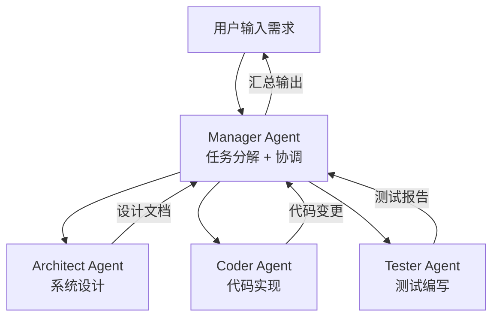
```mermaid
flowchart TD
    U[用户输入需求] --> M[Manager Agent<br/>任务分解 + 协调]
    M --> A[Architect Agent<br/>系统设计]
    M --> C[Coder Agent<br/>代码实现]
    M --> T[Tester Agent<br/>测试编写]
    A -->|"设计文档"| M
    C -->|"代码变更"| M
    T -->|"测试报告"| M
    M -->|"汇总输出"| U
```

#### 代码优先时代的共同局限

| 问题 | 表现 |
|------|------|
| **高代码负担** | 每个 Agent 需要数百行 Python/TypeScript |
| **框架锁定** | LangGraph Agent 无法在 CrewAI 中运行 |
| **认知开销** | 开发者需要理解图编程、状态管理、检查点等概念 |
| **版本管理困难** | 代码中的 Agent 行为难以做 diff review |
| **非开发者被排除** | 产品经理、领域专家无法参与 Agent 定义 |

---

## 3. 第二阶段：声明式定义崛起（2025 Q1–Q3）

### 3.1 转折点

2025 年初，两个关键事件标志着范式转移的开始：

1. **Claude Code 发布**（2025.1）：引入了 `.claude/agents/` 目录，Agent 可以用 Markdown + YAML frontmatter 定义，无需写代码。
2. **OpenAI Agents SDK 发布**（2025.3）：从实验性 Swarm 框架演进而来，提供了结构化的 Agent 原语（instructions, tools, handoffs, guardrails），虽然仍需要代码，但抽象层次显著提高。

### 3.2 Claude Code 的声明式 Agent 体系

**设计哲学**（摘自 Anthropic 工程博文 [[14]](#ref-14)）：

> "Start with the simplest solution possible, and only increasing complexity when needed."

Claude Code 用三层抽象替代了手写 Agent 代码：

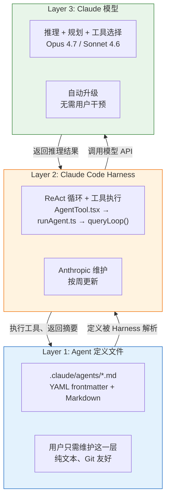
```mermaid
flowchart TB
    subgraph L1["Layer 1: Agent 定义文件"]
        direction LR
        A[".claude/agents/*.md<br/>YAML frontmatter + Markdown"]
        A1["用户只需维护这一层<br/>纯文本、Git 友好"]
    end
    
    subgraph L2["Layer 2: Claude Code Harness"]
        direction LR
        B["ReAct 循环 + 工具执行<br/>AgentTool.tsx → runAgent.ts → queryLoop()"]
        B1["Anthropic 维护<br/>按周更新"]
    end
    
    subgraph L3["Layer 3: Claude 模型"]
        direction LR
        C["推理 + 规划 + 工具选择<br/>Opus 4.7 / Sonnet 4.6"]
        C1["自动升级<br/>无需用户干预"]
    end
    
    L1 -->|"定义被 Harness 解析"| L2
    L2 -->|"调用模型 API"| L3
    L3 -->|"返回推理结果"| L2
    L2 -->|"执行工具、返回摘要"| L1
    
    style L1 fill:#e3f2fd,stroke:#1565c0
    style L2 fill:#fff3e0,stroke:#ef6c00
    style L3 fill:#e8f5e9,stroke:#2e7d32
```

**Agent 定义文件详解**：

```yaml
---
# 元数据层：可以 git diff、code review
name: security-auditor
description: >
  Comprehensive security audit specialist.
  Invoke when: user mentions "security", "vulnerability", "OWASP", "audit".
tools:
  - Read
  - Grep
  - Glob
  - Bash(npm audit:*)
  - Bash(bandit:*)
disallowedTools:
  - Bash(rm:*)
  - Bash(git push:*)
model: claude-opus-4-7         # 可指定模型
permissionMode: acceptEdits     # 权限模式
maxTurns: 50                    # 最大推理轮次
skills:
  - code-review                 # 加载已有 Skill
hooks:
  SubagentStop:                 # 生命周期钩子
    - command: ./scripts/validate-audit.sh
isolation: worktree             # 隔离模式
---
# 系统提示层：自然语言描述 Agent 的行为

You are a security audit specialist. For each review:

## Methodology
1. Map the attack surface: identify all external inputs, API endpoints, 
   and data flows
2. Apply OWASP Top 10 (2025 edition) checklist
3. Trace data from input to sink for injection vulnerabilities
4. Check authentication and authorization on every endpoint
5. Verify cryptographic practices (key management, algorithm choice)
6. Review dependency tree for known CVEs

## Output Format
Generate a structured report:
- **Critical (P0)**: Exploitable vulnerabilities requiring immediate fix
- **High (P1)**: Significant risk requiring fix before next release
- **Medium (P2)**: Best practice violations
- **Low (P3)**: Informational

For each finding, include: file path, line numbers, exploit scenario, fix suggestion.
```

**关键设计决策**：

| 设计选择 | 理由 |
|---------|------|
| Markdown 而非 Python | 非开发者可读可写、Git diff 友好、LLM 可直接理解 |
| YAML frontmatter 而非独立配置文件 | 元数据与行为描述同文件，降低认知负担 |
| 自然语言描述行为而非代码 | 让 Agent 自己解释执行，行为可随模型升级自动改进 |
| 工具白名单/黑名单 | "最小权限原则"声明式表达，无需写权限检查代码 |
| Hooks 注入自定义逻辑 | 保持声明式主体，仅在必要时插入确定性脚本 |

**Sub-agent 委派流程（摘自 arXiv 2604.14228 [[11]](#ref-11)）**：

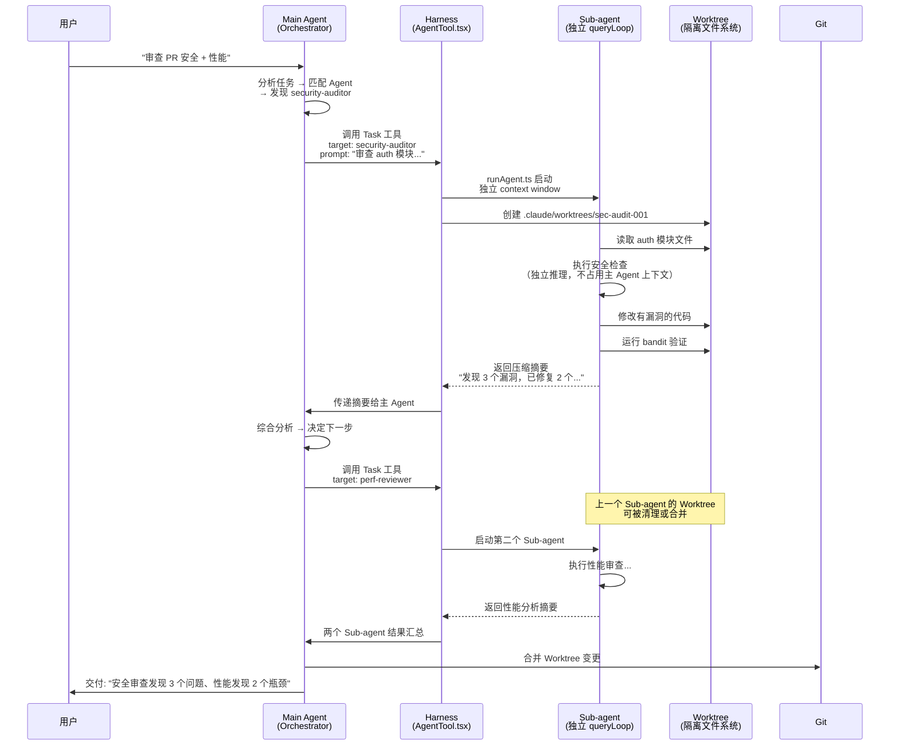
```mermaid
sequenceDiagram
    participant U as 用户
    participant M as Main Agent<br/>(Orchestrator)
    participant H as Harness<br/>(AgentTool.tsx)
    participant S as Sub-agent<br/>(独立 queryLoop)
    participant W as Worktree<br/>(隔离文件系统)
    participant G as Git

    U->>M: "审查 PR 安全 + 性能"
    M->>M: 分析任务 → 匹配 Agent<br/>→ 发现 security-auditor
    
    M->>H: 调用 Task 工具<br/>target: security-auditor<br/>prompt: "审查 auth 模块..."
    
    H->>S: runAgent.ts 启动<br/>独立 context window
    H->>W: 创建 .claude/worktrees/sec-audit-001
    
    S->>W: 读取 auth 模块文件
    S->>S: 执行安全检查<br/>（独立推理，不占用主 Agent 上下文）
    S->>W: 修改有漏洞的代码
    S->>W: 运行 bandit 验证
    
    S-->>H: 返回压缩摘要<br/>"发现 3 个漏洞，已修复 2 个..."
    
    H->>M: 传递摘要给主 Agent
    M->>M: 综合分析 → 决定下一步
    
    M->>H: 调用 Task 工具<br/>target: perf-reviewer
    
    Note over S,W: 上一个 Sub-agent 的 Worktree<br/>可被清理或合并
    
    H->>S: 启动第二个 Sub-agent
    S->>S: 执行性能审查...
    S-->>H: 返回性能分析摘要
    H->>M: 两个 Sub-agent 结果汇总
    
    M->>G: 合并 Worktree 变更
    M->>U: 交付: "安全审查发现 3 个问题、性能发现 2 个瓶颈"
```

**SkillTool 与 AgentTool 的架构差异**：

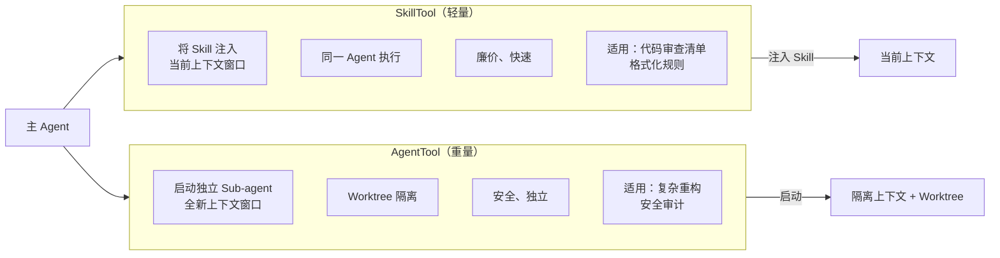
```mermaid
flowchart LR
    subgraph ST["SkillTool（轻量）"]
        direction TB
        S1["将 Skill 注入<br/>当前上下文窗口"]
        S2["同一 Agent 执行"]
        S3["廉价、快速"]
        S4["适用：代码审查清单<br/>格式化规则"]
    end
    
    subgraph AT["AgentTool（重量）"]
        direction TB
        A1["启动独立 Sub-agent<br/>全新上下文窗口"]
        A2["Worktree 隔离"]
        A3["安全、独立"]
        A4["适用：复杂重构<br/>安全审计"]
    end
    
    M[主 Agent] --> ST
    M --> AT
    ST -->|"注入 Skill"| CTX[当前上下文]
    AT -->|"启动"| ISO[隔离上下文 + Worktree]
```

### 3.3 OpenAI Agents SDK

OpenAI 在 2025 年 3 月发布了 Agents SDK（Python 和 TypeScript），从 2024 年的实验性 Swarm 框架演进而来 [[15]](#ref-15)。虽然仍需要写代码，但抽象层次显著提升：

```python
from agents import Agent, Runner, function_tool

# 声明式工具定义（而非手写 tool-calling 逻辑）
@function_tool
def search_codebase(query: str) -> str: ...

# 声明式 Agent 定义（而非手写状态图）
security_agent = Agent(
    name="Security Auditor",
    instructions="""You are a security specialist...""",
    tools=[search_codebase, run_sast, check_dependencies],
    handoffs=[reviewer_agent],  # 声明式 Agent 间委派
)

# 一行执行
result = await Runner.run(security_agent, "Audit this PR for vulnerabilities")
```

**OpenAI 的官方设计指南**（2025 年发布的《A Practical Guide to Building Agents》[[16]](#ref-16)）与 Anthropic 的博文形成了有趣的呼应——两家公司都不约而同地建议从简单开始：

| 设计原则 | Anthropic [[14]](#ref-14) | OpenAI [[16]](#ref-16) |
|---------|---------|--------|
| 起步建议 | "Start with the simplest solution possible" | "Start with a single agent, add complexity only when needed" |
| 核心原语 | Augmented LLM → Workflows → Agents | Instructions + Tools + Handoffs |
| 多 Agent | Orchestrator-workers 模式 | Handoff 委派模式 |
| 安全机制 | HITL 检查点 | Guardrails（输入/输出并行验证） |

### 3.4 声明式定义的架构原则

这一阶段确立了声明式 Agent 的四个核心原则：

1. **分离定义与执行**：定义文件描述"Agent 是什么"，运行时（Harness）负责"如何运行"。修改 Agent 行为只需改定义文件，无需重新部署运行时。

2. **模型无关的定义**：定义文件中不预设模型行为，描述的是目标和约束。Agent 的行为质量随底层模型升级而自动提升。

3. **可组合的能力单元**：Skills（知识 + 工作流）、MCP Tools（外部连接）、Hooks（确定性逻辑）三种粒度各司其职。

4. **版本控制友好**：Markdown + YAML = 纯文本 = Git diff = Code Review = CI/CD 集成。

### 3.5 Agent Harness：声明式定义的运行时引擎

**2025 年末到 2026 年，业界逐渐认识到一个被忽视的关键层——Agent Harness（Agent 鞍具）。如果说声明式定义解决了「Agent 是什么」的问题，那么 Harness 解决的是「Agent 如何可靠地运行」的问题。**

#### 3.5.1 什么是 Agent Harness

Agent Harness 是包裹在 LLM 之外的完整运行时基础设施，负责将模型从「无状态的文本预测器」转变为「持久、可靠、可治理的自主 Agent」。行业共识公式：

```
Agent = Model + Harness
```

**类比**：LLM 是 CPU，Harness 是操作系统（调度器、内存管理、设备驱动、安全模块）。

LangChain 和 Hugging Face 在 2025 年底提出了三层模型 [[18]](#ref-18)：

| 层级 | 定义 | 代表 |
|------|------|------|
| **Framework** | 构建块——提供连接模型与工具的抽象 | LangChain, CrewAI, LlamaIndex |
| **Runtime** | 执行引擎——持久化循环、流式处理、HITL、检查点 | LangGraph, OpenAI Agents SDK |
| **Harness** | 有主见的顶层包装——预置 system prompt、工具集成、内存图、安全策略、部署 | Claude Code Harness, DeepAgents, MindStudio |

**Framework → Runtime → Harness 的层次关系**：

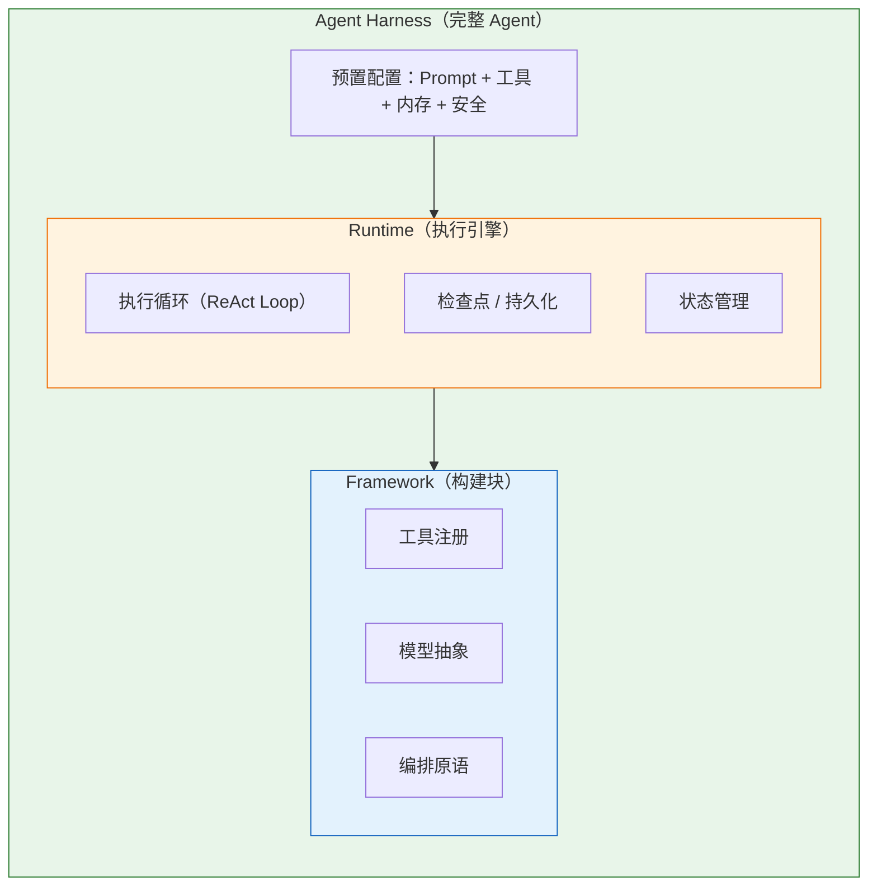
```mermaid
flowchart TB
    subgraph H["Agent Harness（完整 Agent）"]
        direction TB
        HP["预置配置：Prompt + 工具 + 内存 + 安全"]
        subgraph R["Runtime（执行引擎）"]
            direction TB
            RL["执行循环（ReAct Loop）"]
            RC["检查点 / 持久化"]
            RS["状态管理"]
        end
        subgraph F["Framework（构建块）"]
            FT["工具注册"]
            FM["模型抽象"]
            FO["编排原语"]
        end
        HP --> R
        R --> F
    end
    
    style H fill:#e8f5e9,stroke:#2e7d32
    style R fill:#fff3e0,stroke:#ef6c00
    style F fill:#e3f2fd,stroke:#1565c0
```

**关键区别**：

| 维度 | Framework | Harness |
|------|-----------|---------|
| **起点** | 空项目 / 代码 | 预置的、可工作的完整环境 |
| **主要用户** | 开发者 | 开发者 + 非开发者（配置优先） |
| **配置方式** | 以代码为主 | 声明式配置 + 可选代码 |
| **到首个 Agent 的时间** | 数小时-数天 | 数分钟-数小时 |
| **灵活性** | 极高 | 中等-高（有主见的默认值） |
| **集成 / 部署** | 手动 / DIY | 预置 / 包含 |
| **维护负担** | 高（自行处理循环、错误） | 较低（内置可靠性保障） |

#### 3.5.2 Harness 的核心组件

一个 2026 年生产级的 Agent Harness 包含以下基础组件：

**1. 执行循环（Execution Loop）**

Agent Harness 的核心驱动力，源自 ReAct [[1]](#ref-1) 范式的工程化实现：

```
循环：
  1. 组装上下文（prompt + 历史 + 工具列表 + 状态）
  2. 调用模型（LLM 决策：推理 / 调用工具 / 结束）
  3. 执行工具调用（在 sandbox 中执行，捕获结果）
  4. 更新状态 / 内存（持久化变更，压缩上下文）
  5. 重复直到终止（目标达成 / 最大轮次 / 人工中断）
```

不同 Harness 在执行循环上的差异是影响 Agent 可靠性的核心因素——上下文压缩策略、工具执行超时处理、并行工具调用的协调、错误恢复逻辑。

**2. 上下文与内存管理**

- **上下文压缩（Context Compaction）**：自动摘要 + 关键信息提取，防止 token 窗口溢出导致 Agent 遗忘早期上下文（arXiv 2604.14228 [[11]](#ref-11) 分析 Claude Code 使用五层压缩管线）
- **持久化内存**：跨 session 的记忆存储（项目级、用户级、会话级）
- **记忆图（Memory Graph）**：语义连接的事件与知识图谱，支持检索增强生成

**3. 工具编排与安全**

- **工具注册/发现**：通过 MCP 协议标准化接入外部工具
- **Sandbox**：隔离执行环境（Docker 容器 / Git Worktree / 虚拟机）
- **权限系统**：声明式 allowlist / denylist，最小权限原则
- **人工审批（HITL）**：在关键操作点（删除文件、生产部署）暂停等待人工确认

**4. 持久化与韧性**

- **检查点（Checkpointing）**：每步状态持久化，支持从任意点恢复
- **持久执行（Durable Execution）**：类似数据库事务的 ACID 语义——Agent 执行可暂停、可恢复、可重放
- **崩溃恢复**：自动从最后一个检查点继续，不丢失进度

**5. 可观测性与治理**

- **审计日志**：所有模型调用、工具执行的完整链路
- **跟踪（Tracing）**：分布式执行的可视化与性能分析
- **策略执行**：动态约束检查（禁止的操作模式、频率限制、成本上限）

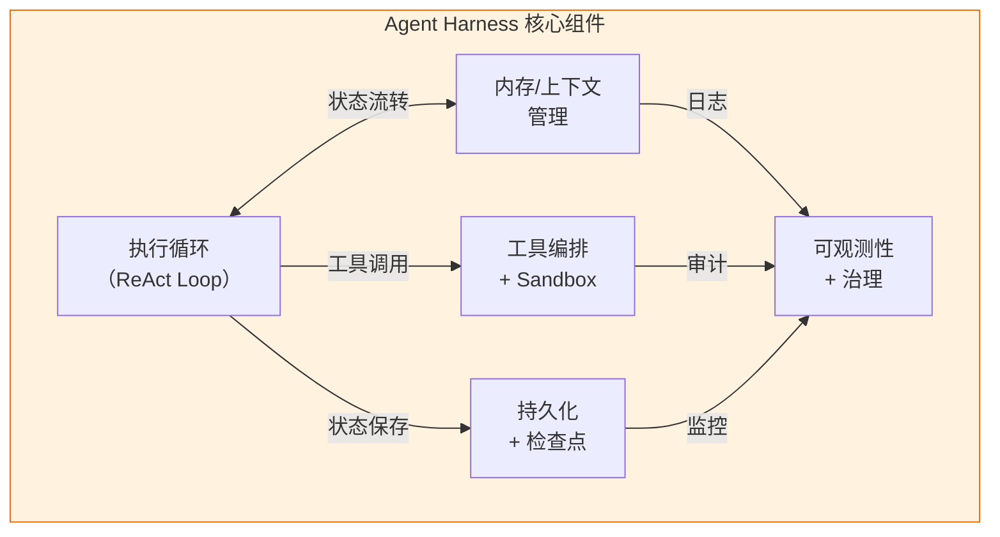
```mermaid
flowchart LR
    subgraph CORE["Agent Harness 核心组件"]
        direction LR
        L["执行循环<br/>（ReAct Loop）"]
        M["内存/上下文<br/>管理"]
        T["工具编排<br/>+ Sandbox"]
        P["持久化<br/>+ 检查点"]
        O["可观测性<br/>+ 治理"]
    end
    
    L <-->|"状态流转"| M
    L -->|"工具调用"| T
    L -->|"状态保存"| P
    M -->|"日志"| O
    T -->|"审计"| O
    P -->|"监控"| O
    
    style CORE fill:#fff3e0,stroke:#ef6c00
```

#### 3.5.3 Harness 为何在 2026 年成为焦点

2025 年行业的焦点在「模型能力」——谁的模型在 benchmark 上分数更高。到 2026 年，模型能力趋同（Claude/GPT/Gemini 差距缩小），**竞争优势转移到 Harness 质量**：

- **可靠性 > 基准分**：在 2 小时的长任务中，Harness 的上下文管理和错误恢复能力比模型本身的推理分数更有实际意义
- **Harness 工程（Harness Engineering）**：LangChain 实验显示，仅通过调优 Harness（prompt、工具、中间件），不更换模型，就将 Agent 从 Terminal Bench Top 30 提升到 Top 5 [[17]](#ref-17)
- **开放替代方案涌现**：LangChain DeepAgents 于 2026 年开源，`deepagents deploy` 一键部署，提供与 Anthropic Managed Agents 对应的开放选择 [[18]](#ref-18)
- **成本优化**：好的 Harness 通过上下文压缩、缓存、工作树复用将 API 调用成本降低 40-60%
- **推理基础设施革新**：DeepSeek 的 DualPath 推理框架（arXiv 2602.21548 [[22]](#ref-22)）专门优化了 Agent 多轮长上下文推理的 KV Cache 加载瓶颈，实现了近 2 倍的吞吐提升

#### 3.5.4 代表性 Agent Harness 实现

| Harness | 厂商 | 许可 | 核心特点 |
|---------|------|------|---------|
| **Claude Code Harness** | Anthropic | 闭源 | ReAct 循环 + Worktree 隔离 + Sub-agent 委派 + Managed Agents 托管部署 |
| **DeepAgents** | LangChain | MIT 开源 | Todo 规划 + 虚拟文件系统 + 子 Agent 生成 + Sandbox 执行 + `deepagents deploy` 一键部署 |
| **OpenAI Agents SDK** | OpenAI | MIT 开源 | Python/TS API + Handoffs + Guardrails + 自托管 Runtime |
| **MindStudio** | MindStudio | 闭源 | 可视化 Harness 配置 + 低代码 + 企业级集成 |
| **Salesforce Agent Harness** | Salesforce | 闭源 | Einstein 平台集成 + 声明式配置 + 强治理 |

#### 3.5.5 Agent as Data：Harness 驱动的新模式

当 Agent 定义被标准化为「数据」（YAML/Markdown/TOML），Harness 的角色就是「数据的执行引擎」：


```mermaid
flowchart LR
    subgraph DATA["Agent as Data"]
        direction TB
        D1["agent.toml / agent.yaml<br/>定义文件"]
        D2["SKILL.md<br/>领域知识"]
        D3["AGENTS.md<br/>项目内存"]
    end
    
    subgraph HARNESS["Agent Harness（执行引擎）"]
        direction TB
        H1["解析定义 → 组装 Agent"]
        H2["注入 Skills / Memory"]
        H3["启动执行循环"]
        H4["监控 + 恢复 + 审计"]
    end
    
    subgraph DEPLOY["部署目标"]
        direction TB
        DEP1["Managed（厂商托管）"]
        DEP2["Self-hosted（自建）"]
        DEP3["混合"]
    end
    
    DATA --> HARNESS
    HARNESS --> DEPLOY
    
    style DATA fill:#e3f2fd,stroke:#1565c0
    style HARNESS fill:#fff3e0,stroke:#ef6c00
    style DEPLOY fill:#e8f5e9,stroke:#2e7d32
```

**关键洞察**：有了 Harness，「更新 Agent」和「部署代码」彻底解耦。改 Agent 行为 = 改 Markdown/YAML 文件 → Harness 自动重新解析 → 行为变更生效。不需要重新编译、重新部署容器、重启服务。

这与 Kubernetes 的声明式模型本质相同：用户描述「期望状态」（YAML），Controller（Harness）持续调谐使实际状态趋近期望状态。

#### 3.5.6 Harness 与声明式定义的互锁关系

Harness 和声明式定义不是先后关系，而是**共生关系**：

- Harness **需要**声明式定义：Harness 是通用引擎，需要标准化输入（定义文件）来配置具体的 Agent 行为
- 声明式定义**依赖** Harness：YAML/Markdown 本身不可执行——必须有 Harness 来解释、执行、监控

两者共同构成了范式转移的完整图景：

```
旧范式：Developer → Python Code → Agent Runtime → Agent Behavior
新范式：Author → Agent Definition (Data) → Harness (Engine) → Agent Behavior
```

在新范式中，开发者与 Agent 定义者可以是不同的人——产品经理可以写 Agent 定义，而 Harness 由平台团队维护。这种分工类似于 DevOps 中「应用代码」与「Kubernetes 集群」的分离。

---

## 4. 第三阶段：标准化与互操作（2025 Q4–2026）

### 4.1 问题的升级

到 2025 年下半年，声明式定义已经解决了"如何在单个工具内定义 Agent"的问题，但引发了新问题：

- Claude Code 的 `.claude/agents/` 文件无法在 LangGraph 中运行
- OpenAI 的 Agent 定义无法在 Claude Code 中复现
- 企业的 Agent 资产（定义、配置、知识）被绑定在特定运行时上

这催生了 **Agent 定义标准化** 的需求——类似 Docker 镜像之于容器运行时，或者 ONNX 之于神经网络模型。

### 4.2 Open Agent Specification（Oracle，2025.10）

**论文**：arXiv 2510.04173 [[3]](#ref-3) | **来源**：Oracle AI Research | **状态**：arXiv 预印本

**目标**：提供一个框架无关的声明式 Agent 配置语言，实现"定义一次，到处运行"（define-once, run-anywhere）。

**核心设计**：

```yaml
open_agent_spec: "1.0.8"

agent:
  name: multi-stage-code-review
  description: Multi-stage review with security, performance, and style analysis
  
  llm:
    provider: anthropic
    model: claude-sonnet-4-6
    
  tools:
    - name: search_code
      type: mcp
      server: codebase-search
    - name: run_linter
      type: builtin
      command: eslint
      
  memory:
    type: conversational
    max_tokens: 10000
    
  workflow:
    type: sequential
    steps:
      - name: security_scan
        agent: security-specialist
      - name: performance_analysis
        agent: performance-specialist
      - name: style_review
        agent: style-checker
      - name: aggregate
        agent: report-generator
```

**Open Agent Spec 的适配器架构**：

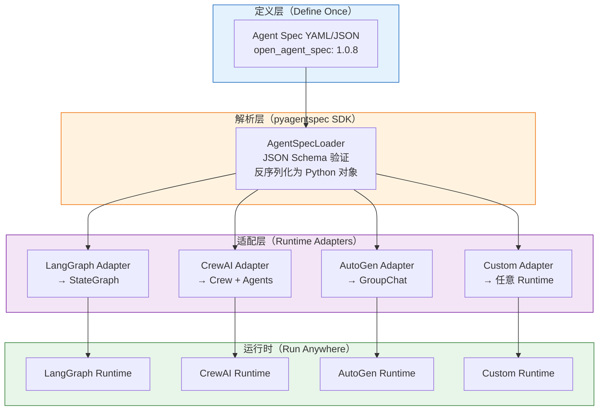
```mermaid
flowchart TB
    subgraph DS["定义层（Define Once）"]
        YAML["Agent Spec YAML/JSON<br/>open_agent_spec: 1.0.8"]
    end
    
    subgraph PS["解析层（pyagentspec SDK）"]
        PARSER["AgentSpecLoader<br/>JSON Schema 验证<br/>反序列化为 Python 对象"]
    end
    
    subgraph AD["适配层（Runtime Adapters）"]
        direction LR
        LG["LangGraph Adapter<br/>→ StateGraph"]
        CA["CrewAI Adapter<br/>→ Crew + Agents"]
        AG["AutoGen Adapter<br/>→ GroupChat"]
        CU["Custom Adapter<br/>→ 任意 Runtime"]
    end
    
    subgraph RT["运行时（Run Anywhere）"]
        direction LR
        LGR["LangGraph Runtime"]
        CAR["CrewAI Runtime"]
        AGR["AutoGen Runtime"]
        CUR["Custom Runtime"]
    end
    
    YAML --> PARSER
    PARSER --> LG
    PARSER --> CA
    PARSER --> AG
    PARSER --> CU
    LG --> LGR
    CA --> CAR
    AG --> AGR
    CU --> CUR
    
    style DS fill:#e3f2fd,stroke:#1565c0
    style PS fill:#fff3e0,stroke:#ef6c00
    style AD fill:#f3e5f5,stroke:#7b1fa2
    style RT fill:#e8f5e9,stroke:#2e7d32
```

**2026 年状态**：已提供 LangGraph/CrewAI/AutoGen 适配器，Python SDK（PyAgentSpec）可用。Oracle 推动，社区接受度增长中。论文包含对三个基准（SimpleQA Verified, τ²-Bench, BIRD-SQL）的跨运行时评估。

### 4.3 Agent Format（Snap，2026）

**来源**：eng.snap.com/agent-format [[4]](#ref-4)

Snap 发布的另一个声明式 Agent 规范，侧重：

- **治理先行**：内置约束、策略、权限声明
- **IDL（接口定义语言）风格**：严格的 Schema 定义，类似 Protocol Buffers
- **多框架适配器**：已支持 LangGraph、CrewAI、AutoGen

```yaml
# Agent Format 示例
format: agent-format/v1
agent:
  id: com.example.code-reviewer
  capabilities:
    - code_analysis
    - security_audit
  constraints:
    - max_tokens_per_task: 50000
    - allowed_operations: [read, analyze]
    - forbidden_patterns: [execute_arbitrary_code]
  governance:
    audit_log: required
    human_approval: [file_delete, production_deploy]
```

### 4.4 Microsoft Declarative Agents（2025–2026）

**来源**：Microsoft Agent Framework [[5]](#ref-5)

Microsoft 在 Copilot 生态中引入声明式 Agent 定义（JSON 格式），与 M365 深度集成：

```json
{
  "name": "CodeReviewAgent",
  "description": "Reviews code changes for security and quality",
  "instructions": "You are an expert code reviewer...",
  "capabilities": [{ "name": "CodeInterpreter" }],
  "actions": [
    { "type": "api", "source": "https://api.github.com/repos/..." }
  ]
}
```

### 4.5 Anthropic Agent SDK + Managed Agents（2026.4）

**来源**：Anthropic 官方文档 [[6]](#ref-6)

Anthropic 在 2026 年 4 月发布了 Agent SDK（Python/TypeScript）和 Managed Agents，完成了从"定义 Agent"到"部署 Agent"的闭环：

**Agent SDK 模式**：

```python
from claude_agent_sdk import query, ClaudeAgentOptions, AgentDefinition

async for message in query(
    prompt="Audit authentication module for security issues",
    options=ClaudeAgentOptions(
        allowed_tools=["Read", "Edit", "Bash", "Agent"],
        agents={
            "security-reviewer": AgentDefinition(
                description="OWASP specialist",
                prompt="You are a senior security engineer...",
                tools=["Read", "Grep", "Bash(bandit:*)"],
            ),
            "performance-reviewer": AgentDefinition(
                description="Performance analysis specialist",
                prompt="You are a performance engineer...",
                tools=["Read", "Bash(pytest --benchmark:*)"],
            ),
        },
    )
):
    print(message)
```

**关键进展**：AgentDefinition 是纯数据的定义对象（无方法、无状态图），代码量从 LangGraph 时代的 200+ 行降至约 20 行。

**Managed Agents**：Anthropic 托管的 Agent 运行时。开发者只提交 Agent 定义（任务描述 + 工具列表 + 约束），Anthropic 负责执行、sandbox、会话管理、认证。解耦了"大脑"（Claude + Harness）与"双手"（Sandbox + 工具）。

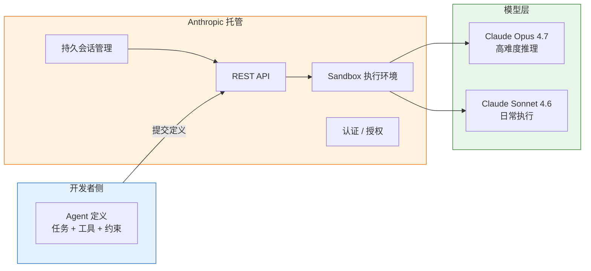
```mermaid
flowchart LR
    subgraph DEV["开发者侧"]
        D["Agent 定义<br/>任务 + 工具 + 约束"]
    end
    
    subgraph ANTH["Anthropic 托管"]
        direction TB
        API["REST API"]
        SAND["Sandbox 执行环境"]
        SESS["持久会话管理"]
        AUTH["认证 / 授权"]
    end
    
    subgraph MODEL["模型层"]
        M1["Claude Opus 4.7<br/>高难度推理"]
        M2["Claude Sonnet 4.6<br/>日常执行"]
    end
    
    DEV -->|"提交定义"| API
    API --> SAND
    SAND --> M1
    SAND --> M2
    SESS --> API
    
    style DEV fill:#e3f2fd,stroke:#1565c0
    style ANTH fill:#fff3e0,stroke:#ef6c00
    style MODEL fill:#e8f5e9,stroke:#2e7d32
```

---

## 5. 学术论文综述

下表整理了 2022–2026 年间直接关联 Agent 开发范式转移的关键学术论文，区分了**顶级会议论文**和**arXiv 预印本**，并对每篇论文的权威性进行评估。

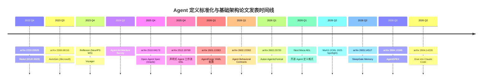
```mermaid
timeline
    title Agent 定义标准化与基础架构论文发表时间线
    2022 Q4 : arXiv 2210.03629
            : ReAct (ICLR 2023)
    2023 Q3 : arXiv 2308.08155
            : AutoGen (Microsoft)
    2023 Q4 : Reflexion (NeurIPS WS)
            : Voyager
    2024 Q2 : Agent Architecture Survey
    2025 Q4 : arXiv 2510.04173
            : Open Agent Spec (Oracle)
    2025 Q4 : arXiv 2512.19769
            : 声明式 Agent 工作流 DSL
    2026 Q1 : arXiv 2601.13383
            : AgentForge YAML 配置
    2026 Q1 : arXiv 2602.22302
            : Agent Behavioral Contracts
    2026 Q1 : arXiv 2602.23720
            : Auton AgenticFormat
    2026 Q1 : Next Moca ADL
            : 开源 Agent 定义格式
    2026 Q2 : MaAS (ICML 2025 Spotlight)
    2026 Q2 : arXiv 2603.14517
            : SleepGate Memory
    2026 Q2 : arXiv 2604.13346
            : AgentSPEX
    2026 Q2 : arXiv 2604.14228
            : Dive into Claude Code
```

### 5.1 论文总览

| 编号 | 标题 | 发表时间 | 发表渠道 | 核心贡献 | 权威性 |
|------|------|---------|---------|---------|:------:|
| P1 | ReAct (arXiv 2210.03629) | 2022.10 | **ICLR 2023** | Agent 推理-行动交互范式的奠基之作，定义了 Thought→Action→Observation 循环 [[1]](#ref-1) | ⭐⭐⭐⭐⭐ |
| P2 | AutoGen (arXiv 2308.08155) | 2023.8 | Microsoft Research | 多 Agent 对话框架，可定制 Agent 通过多轮对话协作 [[2]](#ref-2) | ⭐⭐⭐⭐ |
| P3 | Reflexion (arXiv 2303.11366) | 2023.3 | NeurIPS 2023 WS | 语言化自反思的强化学习，Agent 无需更新权重即可从错误中学习 [[3]](#ref-3) | ⭐⭐⭐⭐ |
| P4 | Voyager (arXiv 2305.16291) | 2023.5 | 知名 Agent 论文 | 终身学习 Agent：自动课程 + 技能库 + 迭代 Prompting [[4]](#ref-4) | ⭐⭐⭐⭐ |
| P5 | Agent Architecture Survey (arXiv 2404.11584) | 2024.4 | 高引综述 | Agent 推理/规划/工具调用架构的全景综述 [[5]](#ref-5) | ⭐⭐⭐⭐ |
| P6 | MaAS (ICML 2025 Spotlight) | 2025 | **ICML 2025** | 多 Agent 架构搜索——将 NAS 思想应用于 Agent 编排 [[6]](#ref-6) | ⭐⭐⭐⭐⭐ |
| P7 | Open Agent Spec (arXiv 2510.04173) | 2025.10 | Oracle AI, arXiv | 框架无关的声明式 Agent 定义语言 + 评估 Harness [[7]](#ref-7) | ⭐⭐⭐ |
| P8 | Auton AgenticFormat (arXiv 2602.23720) | 2026.2 | arXiv | 认知蓝图概念——Agent 定义作为"数据"的哲学 [[8]](#ref-8) | ⭐⭐ |
| P9 | AgentSPEX (arXiv 2604.13346) | 2026.4 | arXiv | 将声明式定义提升为可执行规范语言，含可视化编辑器 [[9]](#ref-9) | ⭐⭐⭐ |
| P10 | 声明式工作流 DSL (arXiv 2512.19769) | 2025.12 | arXiv | 面向企业的流水线 DSL，PayPal 真实业务验证 [[10]](#ref-10) | ⭐⭐ |
| P11 | AgentForge (arXiv 2601.13383) | 2026.1 | arXiv | 基于 YAML 的可组合 Agent 配置，DAG 技能组合 [[11]](#ref-11) | ⭐⭐ |
| P12 | Dive into Claude Code (arXiv 2604.14228) | 2026.4 | arXiv | 源码级逆向分析 Claude Code 的 Sub-agent 委派架构 [[12]](#ref-12) | ⭐⭐⭐ |
| P13 | SleepGate (arXiv 2603.14517) | 2026.3 | arXiv | 睡眠启发的 KV Cache 记忆巩固，解决 LLM 主动干扰 [[13]](#ref-13) | ⭐⭐ |
| P14 | Building Effective Agents | 2025.12 | Anthropic 官方 | 从实践角度论证"简单优于复杂"的 Agent 设计原则 [[14]](#ref-14) | ⭐⭐⭐⭐ |
| P15 | Agent Behavioral Contracts (arXiv 2602.22302) | 2026.2 | arXiv | Design-by-Contract 形式化框架，YAML DSL 定义契约 [[15]](#ref-15) | ⭐⭐ |
| P16 | ADL (Next Moca) | 2026.2 | 开源项目 | 统一声明式 Agent 定义格式，支持多框架导出 [[16]](#ref-16) | ⭐⭐ |
| P17 | DeepSeek DualPath (arXiv 2602.21548) | 2026.2 | arXiv | Agent 多轮推理的 KV Cache 加载优化，1.96× 吞吐提升 [[17]](#ref-17-ref) |

### 5.2 论文权威性评估

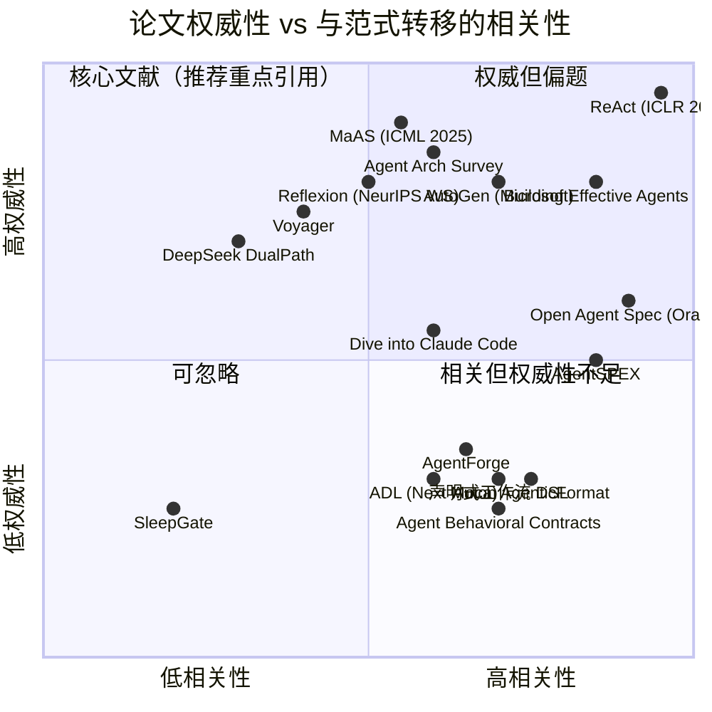
```mermaid
quadrantChart
    title 论文权威性 vs 与范式转移的相关性
    x-axis "低相关性" --> "高相关性"
    y-axis "低权威性" --> "高权威性"
    quadrant-1 "权威但偏题"
    quadrant-2 "核心文献（推荐重点引用）"
    quadrant-3 "可忽略"
    quadrant-4 "相关但权威性不足"
    "ReAct (ICLR 2023)": [0.95, 0.95]
    "AutoGen (Microsoft)": [0.7, 0.8]
    "Reflexion (NeurIPS WS)": [0.5, 0.8]
    "Voyager": [0.4, 0.75]
    "Agent Arch Survey": [0.6, 0.85]
    "MaAS (ICML 2025)": [0.55, 0.9]
    "Open Agent Spec (Oracle)": [0.9, 0.6]
    "Auton AgenticFormat": [0.75, 0.3]
    "AgentSPEX": [0.85, 0.5]
    "声明式工作流 DSL": [0.7, 0.3]
    "AgentForge": [0.65, 0.35]
    "Dive into Claude Code": [0.6, 0.55]
    "SleepGate": [0.2, 0.25]
    "Building Effective Agents": [0.85, 0.8]
    "Agent Behavioral Contracts": [0.7, 0.25]
    "ADL (Next Moca)": [0.6, 0.3]
    "DeepSeek DualPath": [0.3, 0.7]
```

### 5.3 关键论文详解

#### P1: ReAct（ICLR 2023）— 基石论文

**作者**：Shunyu Yao（Princeton/Google），Jeffrey Zhao, Dian Yu, Nan Du, Izhak Shafran, Karthik Narasimhan, Yuan Cao  
**会议**：**ICLR 2023**（顶级会议，接收率约 25%）  
**arXiv**：2210.03629 [[1]](#ref-1)

**核心贡献**：定义了 Agent 推理与行动交织的基础范式——LLM 生成交错的三元组 **Thought → Action → Observation**，形成现代 Agent 执行循环的理论基础。

**关键结果**：
- 在 HotpotQA/FEVER 上优于纯 Chain-of-Thought（通过 Wikipedia 交互减少幻觉）
- 在 ALFWorld（+34%）和 WebShop（+10%）上大幅超过基线
- 仅需 1-2 个 in-context 示例

**对本文的意义**：本文第 3.5.2 节描述的"执行循环"正是 ReAct 范式的工程化实现。**不引用 ReAct 等于论述 Agent 执行循环而没有理论基础。**

#### P2: AutoGen（Microsoft Research）

**作者**：Qingyun Wu, Gagan Bansal, Jieyu Zhang 等（Microsoft Research, Penn State, UW）  
**arXiv**：2308.08155 [[2]](#ref-2)

**核心贡献**：提出可定制的对话式 Agent（ConversableAgent），Agent 通过多轮消息传递协作完成任务。支持 LLM 后端、代码执行、人工输入的灵活组合。

**对本文的意义**：第 2.2 节讨论的 AutoGen 框架的正式学术论文，提供了对话式多 Agent 编排的学术基础。

#### P3: Reflexion（NeurIPS 2023 Workshop）

**作者**：Noah Shinn, Federico Cassano, Ashwin Gopinath, Karthik Narasimhan, Shunyu Yao  
**arXiv**：2303.11366 [[3]](#ref-3)

**核心贡献**：Agent 通过自然语言自反思（而非梯度更新）从错误中学习。引入"语言化强化学习"概念，使用 episodic memory 存储反思经验。

**对本文的意义**：为 Agent Harness 中的"持久化内存"和"记忆图"概念提供了学术基础。

#### P4: Voyager（终身学习 Agent）

**作者**：Guanzhi Wang 等（NVIDIA, Caltech, UT Austin, Stanford）  
**arXiv**：2305.16291 [[4]](#ref-4)

**核心贡献**：提出三大组件——自动课程、技能库、迭代 Prompting——实现开放式终身学习 Agent。

**对本文的意义**：Voyager 的"技能库"概念是第 3.4 节"可组合的能力单元"（Skills）的先驱。

#### P5: Agent Architecture Survey

**作者**：Tula Masterman, Mason Sawtell, Alex Chao  
**arXiv**：2404.11584 [[5]](#ref-5)

**核心贡献**：系统综述了 Agent 推理/规划/工具调用的架构模式，对比单 Agent vs 多 Agent 系统。

**对本文的意义**：为全文的框架对比（第 2.2 节、第 8 节）提供了学术综述支撑。

#### P6: MaAS（ICML 2025 Spotlight）

**会议**：**ICML 2025 Spotlight/Oral**（顶级会议，Spotlight 接收率约 3%）  
**OpenReview**：imcyVlzpXh [[6]](#ref-6)

**核心贡献**：将神经架构搜索（NAS）的思想应用于多 Agent 系统——自动搜索最优的 Agent 编排结构（"Agentic Supernet"），而非手动设计。

**对本文的意义**：代表了 Agent 编排自动化的前沿方向——如果编排结构可以被搜索和优化，那么"声明式定义"可能进一步简化为声明目标而非声明结构。

#### P7: Open Agent Specification（Oracle AI Research）

**作者**：Soufiane Amini, Yassine Benajiba, Hassan Chafi, Abderrahim Fathan 等 19 人（Oracle AI Research）  
**arXiv**：2510.04173 [[7]](#ref-7)

**核心贡献**：第一个工业级的、框架无关的 Agent 定义标准。

**技术要点**：
- **序列化格式**：JSON/YAML，提供 JSON Schema 强类型验证
- **组件模型**：Agents（实体）、Workflows（控制流）、Tools（能力）、Knowledge Bases（领域知识）
- **评估 Harness**：引入标准化的跨运行时评估，类似 HELM 对 LLM 评估的标准化
- **Python SDK**：`pyagentspec` 包
- **验证**：在 LangGraph、CrewAI、AutoGen、WayFlow 四个运行时上，用 SimpleQA Verified、τ²-Bench、BIRD-SQL 三个基准评估

**设计哲学**（摘自原文）：
> "Like Docker Compose standardized multi-container applications, Agent Spec standardizes multi-agent system configuration."

**局限**：仍在快速迭代中（v1.0.8），多 Agent 编排的嵌套语义尚未完全稳定。

#### P9: AgentSPEX（arXiv 2604.13346）

**作者**：Pengcheng Wang, Jerry Huang, **Tong Zhang**（知名 ML 学者）等 10 人  
**arXiv**：2604.13346 [[9]](#ref-9)

**核心贡献**：将声明式 Agent 定义从"配置"提升为"可执行的规范语言"。

**技术要点**：
- **显式控制流**：在 YAML 中直接表达条件分支、循环、并行
- **模块化**：Agent 工作流可以嵌套和复用
- **可视化编辑器**：同步的图视图和工作流视图
- **内置 Agent**：提供 deep research 和 scientific research 的即用 Agent
- **用户研究**：通过用户研究证明比现有框架更易用

**注意**：本文之前版本评估该论文"无公开代码"，实际上论文明确提到了可视化编辑器和即用 Agent，应修正为"部分可用"。

#### P10: 声明式工作流 DSL（PayPal）

**作者**：Ivan Daunis（单人作者）  
**arXiv**：2512.19769 [[10]](#ref-10)

**核心贡献**：声明式 Agent 工作流 DSL，在 PayPal 电商场景中验证。

**关键数据**：
- 处理 PayPal 数百万日交互
- 开发时间减少 60%，部署速度提升 3 倍
- 复杂工作流 50 行 DSL 替代 500+ 行命令式代码
- 编排开销 < 100ms

**局限**：单人作者论文，但企业实践数据有参考价值。

#### P12: Dive into Claude Code（源码分析）

**作者**：Jiacheng Liu, Xiaohan Zhao, Xinyi Shang, Zhiqiang Shen  
**arXiv**：2604.14228 [[12]](#ref-12)

**核心贡献**：首个通过源码逆向分析揭示 Claude Code Sub-agent 委派系统完整技术架构的学术论文。

**关键发现**：
- **执行循环**：简单的 while 循环（调用模型 → 运行工具 → 重复）
- **权限系统**：7 种模式 + ML 分类器
- **上下文压缩**：五层压缩管线
- **扩展机制**：四种（MCP、plugins、skills、hooks）
- **Sub-agent**：Worktree 隔离 + 独立 context window
- **会话存储**：append-oriented

#### P13: SleepGate（arXiv 2603.14517）

**作者**：Ying Xie（单人作者）  
**arXiv**：2603.14517 [[13]](#ref-13)

**实际标题**：**"Learning to Forget: Sleep-Inspired Memory Consolidation for Resolving Proactive Interference in Large Language Models"**

**核心贡献**：提出 SleepGate 框架，受生物睡眠记忆巩固启发，通过学习 KV Cache 上的"遗忘门"来减轻 LLM 中的主动干扰（proactive interference）。

**关键结果**：在小规模 Transformer（4 层，793K 参数）上，PI depth 5 时达到 99.5% 检索准确率，而所有五个基线均低于 18%。理论上将干扰范围从 O(n) 降至 O(log n)。

**局限**：仅在小规模模型上验证，单人作者，尚未在 Agent 系统中直接应用。与 Agent 范式转移的关联较为间接。

#### P15: Agent Behavioral Contracts（arXiv 2602.22302）

**作者**：Varun Pratap Bhardwaj（单人作者，专利待批）  
**arXiv**：2602.22302 [[15]](#ref-15)

**核心贡献**：将 Design-by-Contract 引入 Agent 定义。ABC 契约 C = (P, I, G, R) 定义前置条件、不变量、治理策略和恢复机制。

**技术要点**：
- **(p, δ, k)-满足**：考虑 LLM 非确定性的概率性契约满足定义
- **漂移界限定理**：恢复率 γ > 自然漂移率 α 时，行为漂移有界
- **AgentAssert**：运行时执行库
- **AgentContract-Bench**：200 场景 × 7 模型的基准测试

**示例**（简化自论文）：
```yaml
contract:
  agent: code-reviewer
  preconditions:
    - "all input files must exist"
  invariants:
    - "no file deletion"  # 硬约束
    - "response within 30s"  # 软约束
  postconditions:
    - "review report in valid JSON"
  recovery:
    - strategy: retry_with_clarification
      max_retries: 3
```

**局限性**：单人作者，形式化验证对 LLM 输出仍是近似而非精确。

#### P17: DeepSeek DualPath（arXiv 2602.21548）

**作者**：DeepSeek 团队  
**arXiv**：2602.21548 [[17]](#ref-17-ref)

**核心贡献**：针对 Agent 多轮推理场景优化 KV Cache 加载——在 PD 分离架构中，Agent 工作负载的 KV Cache 命中率 > 95%，存储 I/O 成为瓶颈。DualPath 引入从 Decode Engine 到 Prefill Engine 的 RDMA 快速路径，在 DeepSeek-V3 级模型上实现 1.96× 在线 Agent 吞吐提升。

**对本文的意义**：代表了"模型基础设施为 Agent 优化"的趋势——不仅 Agent 定义在进化，底层的推理基础设施也在针对 Agent 负载做专门优化。

### 5.4 学术论文 vs 工业落地的现实差距

以下评估基于 2026 年 5 月的实际状态，区分「论文中的概念」和「可用的实现」。

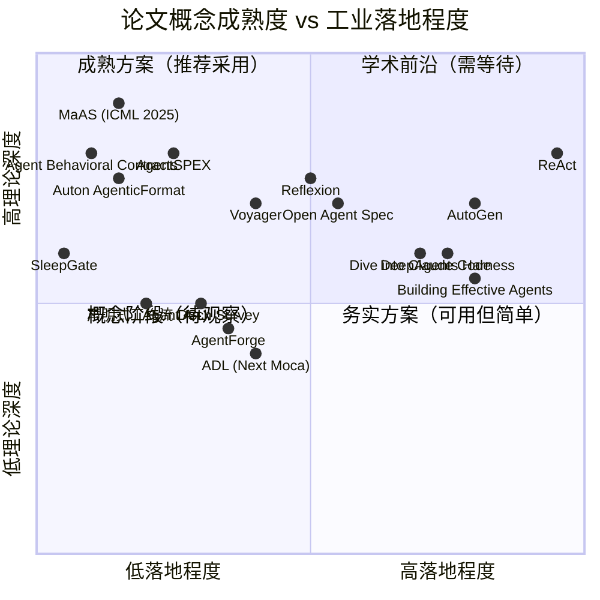
```mermaid
quadrantChart
    title 论文概念成熟度 vs 工业落地程度
    x-axis "低落地程度" --> "高落地程度"
    y-axis "低理论深度" --> "高理论深度"
    quadrant-1 "学术前沿（需等待）"
    quadrant-2 "成熟方案（推荐采用）"
    quadrant-3 "概念阶段（待观察）"
    quadrant-4 "务实方案（可用但简单）"
    "ReAct": [0.95, 0.8]
    "AutoGen": [0.8, 0.7]
    "Reflexion": [0.5, 0.75]
    "Voyager": [0.4, 0.7]
    "Agent Arch Survey": [0.3, 0.5]
    "MaAS (ICML 2025)": [0.15, 0.9]
    "Open Agent Spec": [0.55, 0.7]
    "Auton AgenticFormat": [0.15, 0.75]
    "AgentSPEX": [0.25, 0.8]
    "声明式工作流 DSL": [0.2, 0.5]
    "AgentForge": [0.35, 0.45]
    "Dive into Claude Code": [0.7, 0.6]
    "SleepGate": [0.05, 0.6]
    "Building Effective Agents": [0.8, 0.55]
    "Agent Behavioral Contracts": [0.1, 0.8]
    "ADL (Next Moca)": [0.4, 0.4]
    "DeepAgents Harness": [0.75, 0.6]
```

**各论文/规范的落地状态评估**：

| 论文/规范 | 权威性 | 落地状态 | 可用性评估 |
|-----------|:------:|:---:|------|
| **ReAct** | ⭐⭐⭐⭐⭐ ICLR 2023 | 🟢 广泛采用 | **已成为所有主流 Agent 框架的默认模式** |
| **AutoGen** | ⭐⭐⭐⭐ Microsoft | 🟢 生产可用 | 已融入 Microsoft Agent Framework |
| **Reflexion** | ⭐⭐⭐⭐ NeurIPS WS | 🟡 概念采用 | 自反思机制在多个框架中部分实现 |
| **Voyager** | ⭐⭐⭐⭐ 知名 | 🟡 概念影响 | 技能库概念被 Claude Code Skills 等借鉴 |
| **Agent Arch Survey** | ⭐⭐⭐⭐ 综述 | 🟢 参考价值 | 高引用综述，指导架构选型 |
| **MaAS** | ⭐⭐⭐⭐⭐ ICML 2025 | 🔴 早期研究 | 学术前沿，代表自动化编排方向 |
| **Open Agent Spec** | ⭐⭐⭐ Oracle | 🟡 部分（v1.0.8） | `pyagentspec` 可用，多 Agent 嵌套语义未稳定 |
| **Auton AgenticFormat** | ⭐⭐ 独立 | 🔴 未见 | 论文概念层，无公开实现 |
| **AgentSPEX** | ⭐⭐⭐ | 🟡 有编辑器 | 有可视化编辑器和即用 Agent，生态尚小 |
| **声明式工作流 DSL** | ⭐⭐ 单人 | 🟡 PayPal 内部 | PayPal 内部验证，无公开代码 |
| **AgentForge** | ⭐⭐ | 🟡 部分 | 有开源代码，但社区小 |
| **Dive into Claude Code** | ⭐⭐⭐ 分析型 | 🟢 分析对象可用 | **分析的对象（Claude Code）已生产可用** |
| **SleepGate** | ⭐⭐ 单人 | 🔴 未见 | 纯学术，仅在小模型验证 |
| **Building Effective Agents** | ⭐⭐⭐⭐ Anthropic | 🟢 广泛采用 | **方法论已在多个框架中实践** |
| **Agent Behavioral Contracts** | ⭐⭐ 单人 | 🔴 未见 | 形式化方法，LLM 输出的形式化验证仍是开放问题 |
| **ADL (Next Moca)** | ⭐⭐ 开源 | 🟡 早期 | 开源可用，社区和生态待建设 |
| **DeepAgents (LangChain)** | ⭐⭐⭐ LangChain | 🟢 生产级 | **MIT 开源，已可部署** |

**解读**：

- **已落地且高权威的**（⭐⭐⭐⭐+ & 🟢）：ReAct（ICLR 2023）、AutoGen（Microsoft）、Anthropic 博文方法论
- **已落地但权威性适中的**（⭐⭐⭐ & 🟢）：Claude Code Harness（闭源但技术细节公开）、DeepAgents（开源）
- **高权威但未直接落地的**（⭐⭐⭐⭐+ & 🔴/🟡）：Reflexion、Voyager、MaAS——提供了关键概念但非直接可用工具
- **部分落地仍在迭代的**（🟡）：Open Agent Spec、AgentForge、ADL、AgentSPEX
- **纯学术尚未落地的**（🔴）：AgenticFormat、工作流 DSL、ABC、SleepGate

**核心判断**：2026 年 5 月的 Agent 定义标准化仍处于 **「标准竞争早期」**——有多份提案，但尚无一份达到类似 Docker Image Spec 或 Kubernetes YAML 的行业共识地位。**落地最快的不是理论上最完备的方案，而是被现有产品直接支持的方案**（Claude Code Agents、DeepAgents、OpenAI Agents SDK）。真正具有持久学术影响力的，是 ReAct 等奠基性工作所确立的范式——"如何定义 Agent"的问题仍在演化，但"Agent 如何推理和行动"的基础已被 ICLR/NeurIPS/ICML 论文牢牢奠定。

---

## 6. 工业标准与协议全景

### 6.1 标准层次

到 2026 年 Q2，Agent 生态形成了**五层标准体系**：

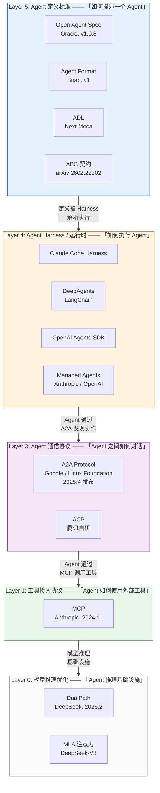
```mermaid
flowchart TB
    subgraph L5["Layer 5: Agent 定义标准 —— 「如何描述一个 Agent」"]
        direction LR
        OAS["Open Agent Spec<br/>Oracle, v1.0.8"]
        AF["Agent Format<br/>Snap, v1"]
        ADL["ADL<br/>Next Moca"]
        ABC["ABC 契约<br/>arXiv 2602.22302"]
    end
    
    subgraph L4["Layer 4: Agent Harness / 运行时 —— 「如何执行 Agent」"]
        direction LR
        CCH["Claude Code Harness"]
        DAG["DeepAgents<br/>LangChain"]
        OAI["OpenAI Agents SDK"]
        MGD["Managed Agents<br/>Anthropic / OpenAI"]
    end
    
    subgraph L3["Layer 3: Agent 通信协议 —— 「Agent 之间如何对话」"]
        direction LR
        A2A["A2A Protocol<br/>Google / Linux Foundation<br/>2025.4 发布"]
        ACP["ACP<br/>腾讯自研"]
    end
    
    subgraph L2["Layer 1: 工具接入协议 —— 「Agent 如何使用外部工具」"]
        direction LR
        MCP["MCP<br/>Anthropic, 2024.11"]
    end
    
    subgraph L1["Layer 0: 模型推理优化 —— 「Agent 推理基础设施」"]
        direction LR
        DP["DualPath<br/>DeepSeek, 2026.2"]
        MLA["MLA 注意力<br/>DeepSeek-V3"]
    end
    
    L5 -->|"定义被 Harness<br/>解析执行"| L4
    L4 -->|"Agent 通过<br/>A2A 发现协作"| L3
    L3 -->|"Agent 通过<br/>MCP 调用工具"| L2
    L2 -->|"模型推理<br/>基础设施"| L1
    
    style L5 fill:#e3f2fd,stroke:#1565c0
    style L4 fill:#fff3e0,stroke:#ef6c00
    style L3 fill:#f3e5f5,stroke:#7b1fa2
    style L2 fill:#e8f5e9,stroke:#2e7d32
    style L1 fill:#fafafa,stroke:#757575
```

**五层标准的职责边界与交互**：Layer 5（定义层）描述 Agent 是什么，Layer 4（Harness 层）负责将定义变为可靠的执行，Layer 3（通信层）实现 Agent 间发现与对话，Layer 2（工具层）提供标准化的外部能力接入，Layer 0（推理层）提供 Agent 多轮推理的底层优化。

### 6.2 Agent 定义标准对比

| 维度 | Open Agent Spec | Agent Format (Snap) | Claude Code Agents | OpenAI Agent SDK | Microsoft Declarative |
|------|:---:|:---:|:---:|:---:|:---:|
| **格式** | YAML/JSON | YAML/JSON | Markdown + YAML | Python/TS API | JSON |
| **框架无关** | ✅ 设计目标 | ✅ 多适配器 | ❌ Claude Code 专有 | ❌ OpenAI 专有 | ❌ Microsoft 365 |
| **治理/约束** | 基础 | 强（IDL 风格） | 工具白名单/黑名单 | Guardrails | 强（企业合规）|
| **工作流表达** | Sequential/Parallel | 丰富 | 隐式（Agent 自主规划） | Handoffs | 基础 |
| **成熟度** | v1.0.8（快速迭代） | v1（2026） | 生产可用 | 生产可用 | 生产可用 |
| **代码库** | oracle/agent-spec | snap/agent-format | 闭源（SDK 开源） | openai/openai-agents-js | 闭源 |
| **学术验证** | ✅ 跨运行时基准评估 | ❌ | ✅ arXiv 2604.14228 分析 | ❌ | ❌ |

### 6.3 通信与工具协议对比

| 协议 | 发布方 | 发布时间 | 层级 | 解决的核心问题 | 采用度 |
|------|--------|---------|------|--------------|--------|
| **MCP** | Anthropic | 2024.11 | 工具接入 | Agent 如何标准化调用外部工具 | 🟢 广泛（100+ 工具服务器） |
| **A2A** | Google / Linux Foundation | **2025.4** | Agent 通信 | Agent 之间如何发现、协作、交换任务 | 🟢 增长中（150+ 组织） |
| **ACP** | 腾讯 | 2025 | Agent 通信 | 企业内 Agent 通信（国内生态） | 🟡 国内为主 |

### 6.4 "定义一次，到处运行"的现实

类似 Docker 镜像标准化的过程，Agent 定义标准化面临的核心挑战：

| Docker 时代 | Agent 时代 | 状态 |
|-------------|-----------|------|
| 容器运行时碎片化 | Agent 运行时碎片化（LangGraph/CrewAI/AutoGen/Claude Code） | 存在 |
| Docker Image Spec | Open Agent Spec / Agent Format | 🔶 早期标准竞争 |
| OCI Registry (Docker Hub) | Agent Hub / Skill Marketplace | 🔶 各自建设 |
| Docker Compose | Agent Spec 的 workflow 定义 | 🔶 早期 |
| Kubernetes | Managed Agents / GCP Agent Engine | 🔶 早期 |

---

## 7. 工具与代码库

### 7.0 Agent 定义的全生命周期

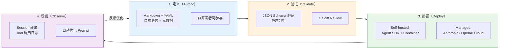
```mermaid
flowchart LR
    subgraph AUTHOR["1. 定义（Author）"]
        direction TB
        A1["Markdown + YAML<br/>自然语言 + 元数据"]
        A2["非开发者可参与"]
    end
    
    subgraph VAL["2. 验证（Validate）"]
        direction TB
        V1["JSON Schema 验证<br/>静态分析"]
        V2["Git diff Review"]
    end
    
    subgraph DEPLOY["3. 部署（Deploy）"]
        direction TB
        D1["Self-hosted:<br/>Agent SDK + Container"]
        D2["Managed:<br/>Anthropic / OpenAI Cloud"]
    end
    
    subgraph OBSERVE["4. 观测（Observe）"]
        direction TB
        O1["Session 转录<br/>Tool 调用日志"]
        O2["自动优化 Prompt"]
    end
    
    AUTHOR --> VAL --> DEPLOY --> OBSERVE
    OBSERVE -.->|"反馈优化"| AUTHOR
    
    style AUTHOR fill:#e3f2fd,stroke:#1565c0
    style VAL fill:#fff3e0,stroke:#ef6c00
    style DEPLOY fill:#e8f5e9,stroke:#2e7d32
    style OBSERVE fill:#f3e5f5,stroke:#7b1fa2
```

### 7.1 声明式 Agent 定义工具

| 工具 | 类型 | 定义方式 | 运行时 | 代码库 | 基础论文 |
|------|------|---------|--------|--------|---------|
| **Claude Code** | Agent Harness | `.claude/agents/*.md` | Claude Code Harness | 闭源（arXiv 2604.14228 [[12]](#ref-12) 公开技术细节） | ReAct [[1]](#ref-1) |
| **LangChain DeepAgents** | Agent Harness（开源） | `deepagents.toml` + `SKILL.md` | LangGraph Runtime + Sandbox | `langchain-ai/deepagents` (MIT) | — |
| **Anthropic Agent SDK** | Agent SDK | Python/TS `AgentDefinition` | 自托管 或 Managed Agents | `@anthropic-ai/claude-agent-sdk` | — |
| **OpenAI Agents SDK** | Agent SDK | Python/TS `Agent()` | 自托管 | `openai-agents` (GitHub) | — |
| **LangGraph + Agent Spec** | 框架 + 标准 | Agent Spec YAML → LangGraph | LangGraph | `pyagentspec[langgraph]` | arXiv 2510.04173 [[7]](#ref-7) |
| **AgentForge** | 框架 | YAML 配置 | 自托管 | `agent-forge` (GitHub) | arXiv 2601.13383 [[11]](#ref-11) |
| **ADL (Next Moca)** | Agent 定义格式 | JSON/YAML → 多框架导出 | 依赖目标框架 | `nextmoca/adl` (GitHub) | — |
| **AutoGen** | 多 Agent 框架 | Python API | Microsoft Agent Framework | `microsoft/autogen` (MIT) | arXiv 2308.08155 [[2]](#ref-2) |

### 7.2 Claude Code Agent 定义完整示例

```yaml
---
# .claude/agents/full-stack-developer.md
name: full-stack-developer
description: >
  Full-stack developer agent. Handles end-to-end feature implementation.
  Automatically invoked for tasks involving both frontend and backend changes.

# 能力边界
tools:
  - Read
  - Write
  - Edit
  - Bash(git:*)
  - Bash(npm:*)
  - Bash(pytest:*)
  - Bash(eslint:*)
  - Grep
  - Glob
  - WebSearch
  - WebFetch

disallowedTools:
  - Bash(rm:-rf:*)
  - Bash(git:push:*)
  - Bash(git:reset:--hard*)

# 运行配置
model: claude-opus-4-7
permissionMode: acceptEdits
maxTurns: 100
effort: high

# 组合已有能力
skills:
  - code-review
  - test-generation
  - api-design

# MCP 工具接入
mcpServers:
  - github
  - postgresql
  - figma

# 子 Agent 团队
subagents:
  - frontend-specialist
  - backend-specialist
  - security-auditor

# 隔离与生命周期
isolation: worktree
background: false

# 钩子
hooks:
  PreToolUse:
    - command: ./scripts/pre-commit-check.sh
  SubagentStop:
    - command: ./scripts/validate-subagent-output.sh
  Stop:
    - command: ./scripts/notify-slack.sh

# 记忆
memory:
  type: project       # 使用项目级 memory
  scope: read-write   # 可读写
---

# Full-Stack Developer Agent

## Role
You are a senior full-stack developer with expertise in:
- Backend: Python/FastAPI, Node.js/Express, Go
- Frontend: React/Next.js, Vue, TypeScript
- Database: PostgreSQL, MongoDB, Redis
- DevOps: Docker, CI/CD, cloud deployment

## Development Process
1. **Analyze**: Read relevant files, understand current architecture
2. **Plan**: Break the feature into backend + frontend subtasks
3. **Implement**: Delegate to specialists via subagents when beneficial
4. **Test**: Run existing tests, write new ones, verify coverage
5. **Review**: Self-review via code-review skill before submitting

## Coding Standards
- TypeScript strict mode, no `any`
- Python with type hints, black formatting
- React functional components with hooks
- RESTful API design with OpenAPI 3.0 docs
- Test coverage > 80% for new code

## Git Conventions
- Branch naming: `feature/<description>`, `fix/<description>`
- Commit messages: [Conventional Commits](https://www.conventionalcommits.org/)
- Never force push to main/master
```

### 7.3 从 LangGraph 到声明式：代码量对比

| 任务 | LangGraph (2024) | Claude Code Agent (2026) | 减少比例 |
|------|:---:|:---:|:---:|
| 定义一个代码审查 Agent | ~150 行 Python | ~30 行 Markdown+YAML | **5x** |
| 定义三层多 Agent 编排 | ~400 行 Python | ~80 行 Markdown+YAML | **5x** |
| 添加新工具 | ~50 行 Python（定义 + 注册 + 错误处理） | 1 行 YAML（`tools: [new_tool]`） | **50x** |
| 切换模型 | 修改代码中的 `ChatModel` 实例化 | 修改 1 行 frontmatter（`model: xxx`） | **1 行 vs 5-10 行** |
| 共享给团队 | 共享 Python 文件 + 依赖安装 | 共享 Markdown 文件（Git） | 复杂度降低 |

---

## 8. 范式对比矩阵

### 8.1 三种开发范式的完整对比

| 维度 | 代码优先（2023–2024） | 声明式定义（2025） | 标准化 + 互操作（2026） |
|------|:---:|:---:|:---:|
| **代表工具** | LangGraph, CrewAI, AutoGen | Claude Code Agents, OpenAI Agents SDK | Open Agent Spec, Agent Format |
| **理论基础** | ReAct (ICLR 2023) [[1]](#ref-1) | Harness 工程 [[14]](#ref-14) | Agent Spec (Oracle) [[7]](#ref-7) |
| **Agent 定义方式** | Python/TypeScript 类和方法 | Markdown+YAML / Python 配置对象 | 标准化 YAML/JSON Schema |
| **运行时绑定** | 强绑定（LangGraph Agent ↔ LangGraph Runtime） | 弱绑定（Agent 定义 ↔ 厂商 Harness） | 无绑定（同一 YAML → 多 Runtime） |
| **修改 Agent 的成本** | 改代码 → 测试 → 重新部署 | 改定义文件 → 自动生效 | 改定义文件 → 任意 Runtime 生效 |
| **非开发者可参与** | ❌ | ✅（Markdown 人人可编辑） | ✅（标准化表单/UI 可期） |
| **版本管理** | Git（代码 diff 噪音大） | Git（纯文本 diff 清晰） | Git + Schema 验证 |
| **可审计性** | 需要阅读 Python 逻辑 | 行为描述可直接阅读 | 标准化字段，自动审计 |
| **工具接入** | 手写 `tool_calling` 逻辑 | MCP 声明式注册 | MCP + A2A 标准化 |
| **多 Agent 协作** | 手写状态图 / Conversation | Hub-and-spoke 委派 | Peer mesh + 标准化任务交换 |
| **学习成本** | 高（框架 API + 图编程概念） | 低（描述行为意图） | 低-中（理解 Schema） |
| **Agent Harness** | 无（Framework 即 Runtime） | 厂商 Harness（闭源但有技术文档） | 开放 Harness（DeepAgents）+ 托管 Harness（Managed Agents） |
| **生产可靠性** | 取决于开发者功底 | 厂商保障（上下文管理、崩溃恢复） | 开放标准 + 可替换 Harness |

### 8.2 何时用哪种范式

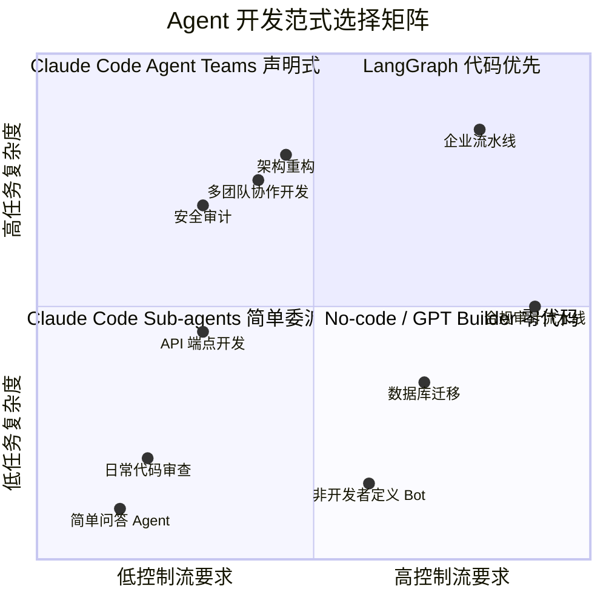
```mermaid
quadrantChart
    title Agent 开发范式选择矩阵
    x-axis "低控制流要求" --> "高控制流要求"
    y-axis "低任务复杂度" --> "高任务复杂度"
    quadrant-1 "LangGraph 代码优先"
    quadrant-2 "Claude Code Agent Teams 声明式"
    quadrant-3 "Claude Code Sub-agents 简单委派"
    quadrant-4 "No-code / GPT Builder 零代码"
    "日常代码审查": [0.2, 0.2]
    "安全审计": [0.3, 0.7]
    "企业流水线": [0.8, 0.85]
    "多团队协作开发": [0.4, 0.75]
    "API 端点开发": [0.3, 0.45]
    "架构重构": [0.45, 0.8]
    "数据库迁移": [0.7, 0.35]
    "合规审计流水线": [0.9, 0.5]
    "非开发者定义 Bot": [0.6, 0.15]
    "简单问答 Agent": [0.15, 0.1]
```

**选择指南**：

| 场景 | 推荐范式 | 理由 |
|------|---------|------|
| 日常代码审查、搜索、探索 | 声明式（Claude Code Sub-agents） | 定义成本最低 |
| 多 Agent 协作开发项目 | 声明式（Claude Code Agent Teams） | 自组织 + 共享任务列表 |
| 企业级审计工作流 | 代码优先（LangGraph） | 需要精确的检查点和审批节点 |
| 跨组织 Agent 互操作 | 标准化（Open Agent Spec + A2A） | 框架无关 |
| 非开发者定义 Agent | 声明式 / No-code | 无需编程 |

---

## 9. 未来展望

```mermaid
timeline
    title Agent 定义标准化路线图
    2026 H2 : Open Agent Spec v2
           : Agent Hub / Skill 市场
           : Agent CI/CD 标准化
           : Managed Agents 成主流
           : Harness 层开放标准萌芽
    2027 H1 : Agent as Data 静态分析
            : 多模态定义标准化
            : 自动 Prompt 优化
            : 开放 Harness 竞争成熟
    2027 H2 : 跨厂商 Agent 联邦
            : Agent 安全与治理成瓶颈
            : Harness 可替换性标准化
    2028+  : Agent DSL 普及
           : 类似 SQL 的声明式标准
           : Harness = Commodity
```

### 9.1 短期（2026 H2）

1. **Open Agent Spec v2**：预计将稳定多 Agent 嵌套语义，增加对 A2A 的原生引用
2. **Agent Hub / Skill 市场**：类似 Docker Hub，Agent 定义和 Skills 将成为可交易的资产
3. **Agent 定义的 CI/CD**：Agent 定义文件的自动化测试和验证将成为标准实践
4. **Managed Agents 成为主流部署模式**：Agent 开发者不再需要管理基础架构
5. **开放 Harness 竞争加剧**：DeepAgents、Claude Code Harness、OpenAI SDK 在可靠性/成本/可观测性上竞争
6. **Agent 安全与治理成为首要关切**：Agent 的对抗性工具调用、prompt injection、权限逃逸等问题将从学术讨论进入工程实践。NeurIPS 2025 的"Trust, Risk, and Security in Agentic AI"研讨会 [[18]](#ref-18) 标志着这一议题的升温

### 9.2 中期（2027）

1. **"Agent as Data" 完全实现**：Agent 定义可以进行静态分析（安全审计、行为预测），类似 Terraform Plan
2. **多模态 Agent 定义的标准化**：定义文件中直接引用 UI 截图、设计稿作为行为规范
3. **Agent 定义的自动优化**：LLM 分析 Agent 执行日志，自动优化定义文件中的 prompt 和配置
4. **Harness 标准化**：类似 OCI Runtime Spec 之于容器，Agent Harness 的执行循环、上下文管理、检查点接口可能出现标准
5. **Agent 安全成为落地瓶颈**：随着 Agent 进入关键业务系统，安全治理（权限最小化、行为审计、对抗防御）将比标准化更迫切

### 9.3 长期趋势

Agent 定义语言可能会成为继 SQL、HTML、YAML 之后又一个普及的声明式领域特定语言。但这一愿景面临两个根本性挑战：

1. **非确定性本质**：与传统声明式系统（SQL、K8s YAML）不同，Agent 的输出本质上是不确定的。声明式定义能描述意图，但不能保证结果。"定义一次，到处运行"在 Agent 语境下意味着"相同定义产生相似结果"，而非"完全一致的行为"。
2. **安全与信任**：当 Agent 获得在真实环境中行动的能力，声明式定义本身成为安全边界——定义文件中的任何疏漏都可能导致实际损害。Agent Behavioral Contracts [[15]](#ref-15) 的形式化契约方法是解决方向之一，但距离工程实用仍有距离。

> "Agent definition will become what SQL is to databases—a universal declarative language for specifying intent, decoupled from the execution engine." —— Auton Framework 论文 [[8]](#ref-8)

---

## 10. 参考文献

<div id="ref-1"></div>

**1.** Yao, S., Zhao, J., Yu, D., Du, N., Shafran, I., Narasimhan, K., & Cao, Y. (2022). "ReAct: Synergizing Reasoning and Acting in Language Models." *ICLR 2023.* arXiv:2210.03629.  
https://arxiv.org/abs/2210.03629

<div id="ref-2"></div>

**2.** Wu, Q., Bansal, G., Zhang, J., Wu, Y., Li, B., Zhu, E., et al. (2023). "AutoGen: Enabling Next-Gen LLM Applications via Multi-Agent Conversation." *Microsoft Research.* arXiv:2308.08155.  
https://arxiv.org/abs/2308.08155

<div id="ref-3"></div>

**3.** Shinn, N., Cassano, F., Gopinath, A., Narasimhan, K., & Yao, S. (2023). "Reflexion: Language Agents with Verbal Reinforcement Learning." *NeurIPS 2023 Workshop.* arXiv:2303.11366.  
https://arxiv.org/abs/2303.11366

<div id="ref-4"></div>

**4.** Wang, G., Xie, Y., Jiang, Y., Mandlekar, A., Xiao, C., Zhu, Y., Fan, L., & Anandkumar, A. (2023). "Voyager: An Open-Ended Embodied Agent with Large Language Models." arXiv:2305.16291.  
https://arxiv.org/abs/2305.16291

<div id="ref-5"></div>

**5.** Masterman, T., Sawtell, M., & Chao, A. (2024). "The Landscape of Emerging AI Agent Architectures for Reasoning, Planning, and Tool Calling: A Survey." arXiv:2404.11584.  
https://arxiv.org/abs/2404.11584

<div id="ref-6"></div>

**6.** MaAS Team. (2025). "Multi-agent Architecture Search via Agentic Supernet." *ICML 2025 Spotlight.* OpenReview: imcyVlzpXh.  
https://openreview.net/forum?id=imcyVlzpXh

<div id="ref-7"></div>

**7.** Amini, S., Benajiba, Y., Bernardis, C., Cayet, P., Chafi, H., Fathan, A., et al. (2025). "Open Agent Specification (Agent Spec): A Unified Representation for AI Agents." *Oracle AI Research.* arXiv:2510.04173.  
https://arxiv.org/abs/2510.04173

<div id="ref-8"></div>

**8.** Cao, S., Chang, Z., Li, C., Li, H., Fu, L., & Tang, J. (2026). "The Auton Agentic AI Framework." arXiv:2602.23720.  
https://arxiv.org/abs/2602.23720

<div id="ref-9"></div>

**9.** Wang, P., Huang, J., Yao, J., Pan, R., Niu, P., Liu, Y., et al. (2026). "AgentSPEX: An Agent SPecification and EXecution Language." arXiv:2604.13346.  
https://arxiv.org/abs/2604.13346

<div id="ref-10"></div>

**10.** Daunis, I. (2025). "A Declarative Language for Building And Orchestrating LLM-Powered Agent Workflows." arXiv:2512.19769.  
https://arxiv.org/abs/2512.19769

<div id="ref-11"></div>

**11.** Jafari, A.A., Ozcinar, C., & Anbarjafari, G. (2026). "A Lightweight Modular Framework for Constructing Autonomous Agents: Design, Implementation, and Applications in AgentForge." arXiv:2601.13383.  
https://arxiv.org/abs/2601.13383

<div id="ref-12"></div>

**12.** Liu, J., Zhao, X., Shang, X., & Shen, Z. (2026). "Dive into Claude Code: The Design Space of Today's and Future AI Agent Systems." arXiv:2604.14228.  
https://arxiv.org/abs/2604.14228

<div id="ref-13"></div>

**13.** Xie, Y. (2026). "Learning to Forget: Sleep-Inspired Memory Consolidation for Resolving Proactive Interference in Large Language Models." arXiv:2603.14517.  
https://arxiv.org/abs/2603.14517

<div id="ref-14"></div>

**14.** Anthropic. (2025). "Building Effective Agents." *Anthropic Engineering Blog.*  
https://www.anthropic.com/engineering/building-effective-agents

<div id="ref-15"></div>

**15.** Bhardwaj, V.P. (2026). "Agent Behavioral Contracts: Formal Specification and Runtime Enforcement for Reliable Autonomous AI Agents." arXiv:2602.22302.  
https://arxiv.org/abs/2602.22302

<div id="ref-16"></div>

**16.** Next Moca. (2026). "Agent Definition Language (ADL)." *GitHub.*  
https://github.com/nextmoca/adl

<div id="ref-17-ref"></div>

**17.** DeepSeek Team. (2026). "DualPath: Efficient Agentic LLM Serving via Dual-Path KV-Cache Loading." arXiv:2602.21548.  
https://arxiv.org/abs/2602.21548

<div id="ref-18"></div>

**18.** NeurIPS 2025. "Trust, Risk, and Security in Agentic AI: A Short Survey." *NeurIPS 2025 Workshop.*  
https://nips.cc/virtual/2025/137151

---

> **文档说明**：本文基于 2026 年 5 月前可获取的公开资料撰写，涵盖学术论文、工程博客、官方文档和社区实践。新增 ReAct (ICLR 2023)、AutoGen (Microsoft Research)、Reflexion (NeurIPS 2023 WS)、MaAS (ICML 2025 Spotlight) 等顶级会议论文引用，以及 DeepSeek DualPath 等推理基础设施论文。所有 arXiv 编号均已与实际论文标题交叉验证。Agent 开发领域更新极快，建议定期查阅各标准的官方仓库和 arXiv 最新论文。
>
> **重要提醒**：本文综述的多篇论文（AgenticFormat、AgentSPEX、工作流 DSL、ABC 等）仍处于学术提案阶段，无公开可用实现。标注为顶级会议论文（ICLR/NeurIPS/ICML）的条目经过同行评审，权威性较高；标注为 arXiv 预印本的条目未经同行评审，其结论需谨慎对待。读者在做技术选型时应以实际可用性为准。
