# 自建服务器：服务部署、服务关系与反向代理（通用版）

> 🎯 本文以「一台高性能迷你工作站裸机运行 Proxmox VE、其上跑 Docker 业务机」为范例，**聚焦三件事：服务部署、服务关系、反向代理**。
> 🧹 已做通用化处理：内网地址用通用示例网段 `192.168.1.0/24`；不含 VPN / 代理上网相关内容；不含从旧机迁移的过程；聚焦当前架构本身。
> 📚 范例硬件：铭凡 MS-02 Ultra（Intel Core Ultra 9 285HX / 32G / 1T NVMe / 双 25G + 10G + 2.5G 网口）。架构与选型思路可平移到任何 x86 服务器/迷你主机。

---

## 0. 架构全景

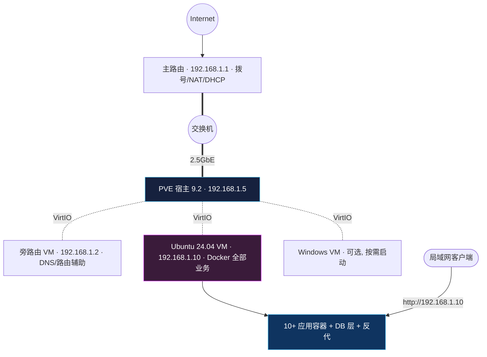

**一句话**：PVE 只做虚拟化；旁路由 VM 负责 DNS 与局域网辅助；Ubuntu VM 用 Docker 跑全部应用，容器间用 Docker DNS 互联，对外仅由一个 **Docker 化 nginx** 暴露 80 端口统一反代，首页是 **Glance** 仪表盘。

---

## 1. 硬件平台（示例）

| 组件 | 配置 | 用途 |
|------|------|------|
| CPU | Intel Core Ultra 9 285HX（24 核 8P+16E） | PVE + 各 VM 计算资源 |
| 内存 | 2×16 GB DDR5（可扩 128 GB） | 初期够用，Win11 常开前升 64G |
| 存储 | 1 TB NVMe | PVE + 全部 VM（单故障域，需外部备份） |
| 核显 | Intel Arc Xe-LPG | 预留（本版不做直通） |
| 2.5 GbE | Intel I226-LM | ✅ 首装管理口 / vmbr0 |
| 10 GbE | Realtek RTL8127 | 后期：存储/NAS 专用链路 |
| 25 GbE ×2 | Intel E810-XXV | 后期：高速存储/工作站 |
| 管理 | Intel vPro/AMT、TPM 2.0 | 带外管理、来电自启 |

> ⚠️ 单块 NVMe 是最大可靠性短板：PVE、各 VM、快照、本地备份共享同一故障域。**必须有目标机之外的备份，快照不是备份。**

---

## 2. 网络框架

### 2.1 设计目标

1. 服务器与家庭网可隔离（规划方向：独立 VLAN）
2. 旁路由 VM 承担 DNS 与 VLAN 间路由
3. 4 个物理网口各司其职（管理 / 存储 / 预留）
4. **可渐进实施**：初期只需一个网口，其余后期启用

### 2.2 三阶段演进路线


- **① 起步**：PVE 与各 VM 同网段，无需交换机支持 VLAN。
- **② 隔离**：交换机端口改 trunk，旁路由承担 VLAN 间路由与防火墙，管理 / 服务 / 隔离 分 VLAN。
- **③ 高速**：vmbr1（10G）纯二层桥接，vmbr2（25G）直连 NAS。

### 2.3 起步拓扑（第一阶段，通用示例网段）

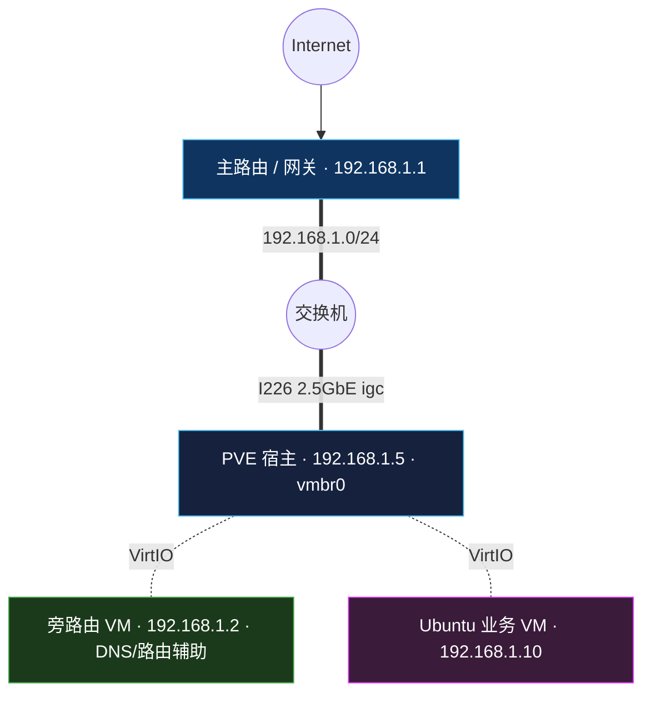

### 2.4 物理网口分工

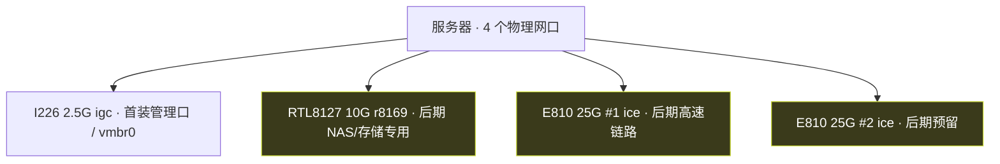

> 切换到 VLAN-aware 架构前，**必须确认本地显示器/键盘或 AMT 带外管理可用**——网络配错会失联，只能本地恢复。

---

## 3. 服务器设计与选型

### 3.1 为什么是 PVE + VM（而不是 ESXi / 裸装 Linux+Docker）

选择 **Proxmox VE 9.2（Debian 13 / KVM）裸机**，核心是**职责单一 + 故障域隔离**：PVE 只做虚拟化，业务全在 VM 内，宿主稳定不受业务变更影响；同时获得 VM 级快照、备份、Web 管理。

### 3.2 关键架构决策

| # | 决策 | 理由 |
|---|------|------|
| 1 | PVE 只做虚拟化，不在宿主跑业务 | 宿主稳定，职责单一 |
| 2 | Docker 装在 Ubuntu VM 内 | 业务变更不影响宿主 |
| 3 | 旁路由 VM 只做 DNS/路由辅助，主路由继续 NAT | 不动既有家庭网 |
| 4 | 首装仅用一个 2.5G 网口 | 降低变量，便于排障 |
| 5 | 10G/25G 后期逐项启用 | 高风险/高功耗项后置 |
| 6 | 单盘必须外部备份 | 单盘是最大短板 |
| 7 | 快照 ≠ 备份，同盘备份 ≠ 灾难恢复 | 需异地副本 |
| 8 | 业务 VM 用单盘（系统+数据合一） | 简化容量管理 |

### 3.3 VM 分工

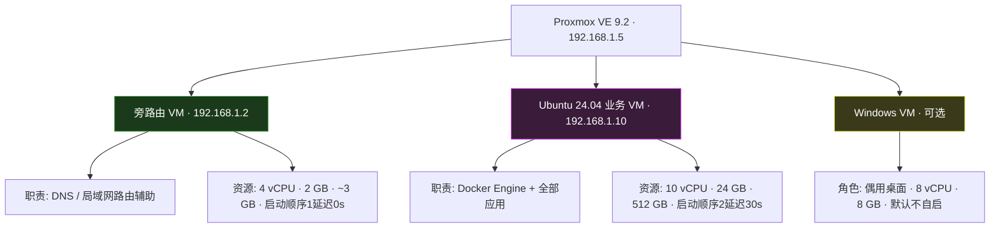

---

## 4. 服务器部署

### 4.1 PVE 安装与换源

- **版本**：PVE 9.2（Debian 13 Trixie，内核 7.0.14，QEMU 11）
- **安装**：UEFI 启动 U 盘，ext4 + LVM-thin，管理口选 I226
- **换源**：替换为清华镜像，采用 **DEB822 格式（`.sources` 文件）**

| 源文件 | 处理 | 说明 |
|--------|------|------|
| `debian.sources` | 清华镜像 | 基础源；**安全更新保留官方**（镜像有同步延迟） |
| `pve-enterprise.sources` | `Enabled: no` | 无订阅会报 401 |
| `proxmox.sources` | 清华镜像 | `pve-no-subscription` 免费通道 |
| `ceph.sources` | `Enabled: no` | 单盘 LVM-thin 不用 Ceph |

> 🚫 不删订阅弹窗（改 `proxmoxlib.js` 是脆弱 hack，升级即失效）；"无有效订阅"提示正常，点关闭即可。

### 4.2 磁盘布局

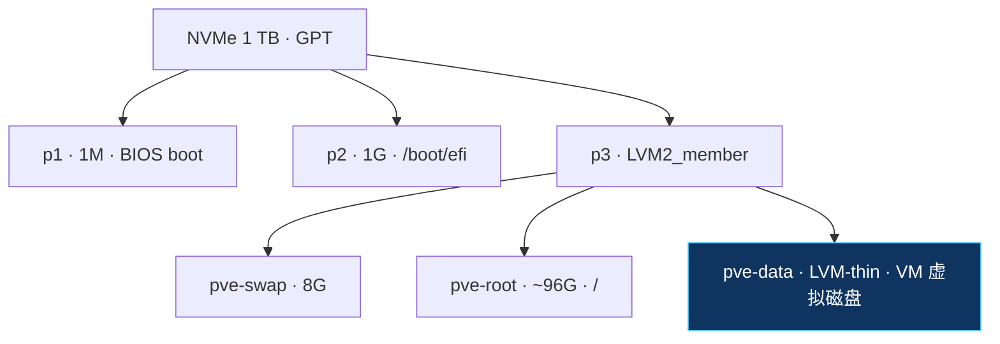

> Thin Pool 不可长期 >80%：到 100% 会使该池所有 VM 同时写入失败。建议 75% 告警、80% 处理。

### 4.3 BIOS / UEFI 要点

| 设置 | 值 | 原因 |
|------|-----|------|
| UEFI Boot / 关 CSM | 开 | PVE 用 UEFI |
| VT-x / VT-d / IOMMU | 开 | KVM + PCIe 直通 |
| Above 4G Decoding | 开 | 预留 GPU 直通 |
| **Restore on AC Power Loss** | **Power On** | 停电恢复自动开机 |
| Sleep/Suspend | 关 | 服务器常开 |
| C-States | 开 | 降待机功耗 |

### 4.4 驱动兼容（实测要点）

| 硬件 | 驱动 | 要点 |
|------|------|------|
| I226 2.5G | `igc` | 管理口，成熟稳定 |
| E810 25G ×2 | `ice` | 已识别，线速/模块兼容待验证 |
| RTL8127 10G | `r8169` | 主线驱动；内核 ≥6.17.11 已修复关机无法开机 bug |
| NVMe | `nvme` | 成熟，监控 SMART/温度即可 |

### 4.5 Ubuntu + Docker 基础环境


关键防护：`/srv` 是独立挂载点时，必须加 systemd unit 片段 `RequiresMountsFor=/srv` + `ConditionPathIsMountPoint=/srv`，**防止 /srv 挂载失败后 Docker 在系统盘悄悄建空目录、写脏数据**。

Docker 网络划分：

| 网络 | 驱动 | 用途 | 是否暴露端口 |
|------|------|------|------------|
| `proxy-net` | bridge | 应用容器 + nginx 反代互通 | 仅 nginx 暴露 80（syncthing 另需放行 P2P :22000/:21027） |
| `db-net` | bridge | PostgreSQL + Redis | ❌ 不发布宿主端口 |

### 4.6 VM 启动与关机顺序

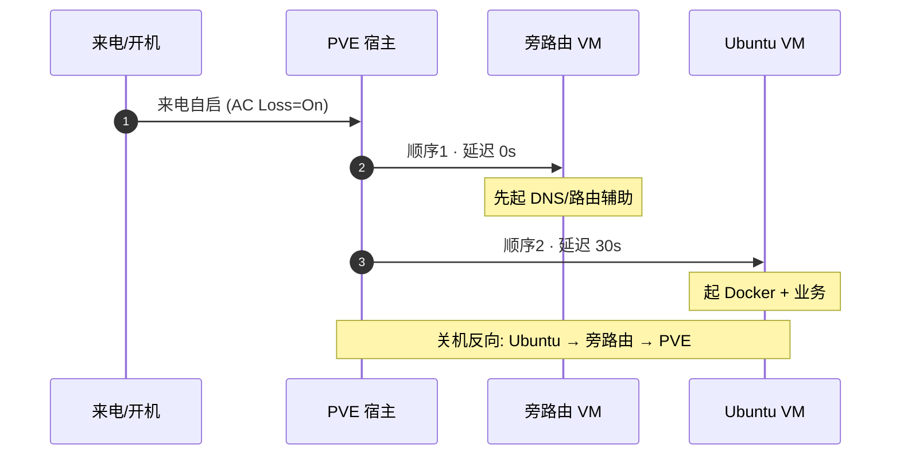

---

## 5. 各服务配置

服务分三层：**systemd 主机服务**（AI 网关/管理面板）+ **Docker 数据库层**（PG/Redis）+ **Docker 应用层**（11 个容器）。

### 5.1 systemd 主机服务（Ubuntu VM 内）

| 服务 | 定位与特点 | 端口 |
|------|-----------|------|
| **cliproxyapi** | AI 订阅聚合网关。把 ChatGPT Codex / Claude Code / Gemini CLI / Qwen 的 OAuth 订阅统一封装成 OpenAI 兼容 API，支持多账户轮询负载均衡、配额超限自动切换、失败重试。是整条 AI 工具链的"水源"，open-webui / openclaw / Claude/Codex CLI 都消费它（详见 5.6） | :8317 |
| **openclaw** | AI 工具 / 多 Agent 网关。可挂多个 Agent（协调、开发、调研等）统一调度，后端模型走 cliproxyapi | :18789 |
| **hermes** | Agent 网关（Python）。后台常驻，提供 Agent 运行时，无对外 Web 端口 | — |
| **cpa-manager** | cliproxyapi 的 Web 管理面板（CPA = CLI-Proxy-API Manager），可视化改配置、查运行状态与用量 | :18317 |

> 这类服务是宿主机进程（非容器），容器要通过 `host.docker.internal:host-gateway` 或宿主 IP 访问它们。

### 5.2 Docker 数据库层（`db-net`，不暴露端口）

```yaml
# compose/core.yml
services:
  postgres:
    image: postgres:17-alpine
    container_name: postgres
    restart: unless-stopped
    environment:
      POSTGRES_USER: ${PG_USER}
      POSTGRES_PASSWORD: ${PG_PASSWORD}
      POSTGRES_DB: appdb
    volumes:
      - /srv/database/postgresql:/var/lib/postgresql/data
    networks: [db-net]

  redis:
    image: redis:7-alpine
    container_name: redis
    restart: unless-stopped
    volumes:
      - /srv/database/redis:/data
    networks: [db-net]
```

> 仅挂 `db-net`，**不发布宿主端口**，只能通过内部网络访问——数据库不触达应用网，是最重要的隔离原则之一。

### 5.3 Docker 应用层（`proxy-net`）

| 容器 | 镜像 | 用途 | 关键配置 |
|------|------|------|---------|
| **nginx** | nginx-local（本地构建） | 反向代理入口 | alpine + `apk add nginx`，详见第 7 章 |
| **glance2** | glanceapp/glance | 🏠 首页仪表盘 | 挂配置目录，配置各类服务书签/监控卡片 |
| open-webui | open-webui/open-webui | AI 对话前端 | `OPENAI_API_BASE_URL` 指向宿主 cliproxyapi |
| alist | xhofe/alist | 网盘挂载/文件列表 | `site_url=/alist`，非 root 运行 |
| suwayomi | suwayomi/suwayomi-server | 漫画阅读器 | — |
| flaresolverr | flaresolverr/flaresolverr | CF 5秒盾绕过 | 被 alist/suwayomi 依赖 |
| code-server | linuxserver/code-server | 浏览器 IDE | 仅挂项目目录（不挂整个家目录） |
| glances | nicolargo/glances | 系统监控 | `pid: host`，经 socket-proxy 读容器 |
| newsnow | 自建镜像 | 新闻/RSS 聚合 | 源码构建 |
| docker-socket-proxy | tecnativa/docker-socket-proxy | Docker API 受控代理 | 替代直挂 docker.sock |
| **syncthing** | syncthing/syncthing | P2P 文件同步 | Obsidian Vault / 数据多端同步（见 5.7） |

**应用层各服务定位**

- **入口与监控**：`glance2` 是首页仪表盘（服务书签 + 站点健康卡片）；`glances` 提供实时系统资源监控（CPU/内存/网络/进程），经 docker-socket-proxy 只读取容器状态。
- **网盘与阅读**：`alist` 把多家网盘聚合成统一文件列表（支持 WebDAV/直链）；`suwayomi` 是漫画聚合阅读器——两者常依赖 `flaresolverr` 绕过 Cloudflare 校验。
- **AI 与开发**：`open-webui` 是类 ChatGPT 的 Web 对话前端，后端指向 cliproxyapi（见 5.6）；`code-server` 是浏览器里的 VS Code，远程改服务器上的 compose/配置。
- **信息聚合**：`newsnow` 抓取多源新闻做聚合页。
- **反代与安全**：`nginx` 统一入口；`docker-socket-proxy` 把 Docker API 降权为只读，避免容器直挂 socket。

### 5.4 部署目录规范（`/srv` 统一管理）

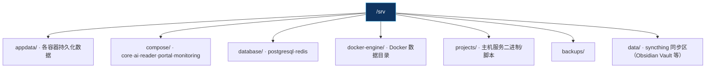

> 配置真实来源 = **Compose 文件 + `.env`（密钥）+ Git 版本管理**，不以 Web 面板手改为唯一来源。

### 5.5 安全配置要点（通用最佳实践）

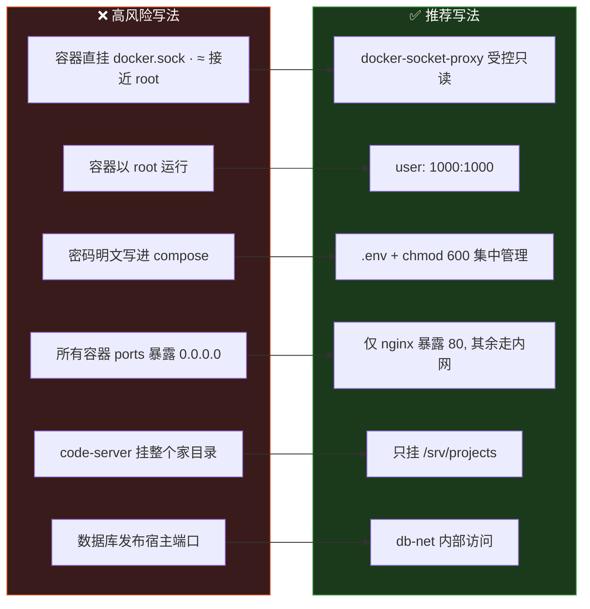

### 5.6 AI 编程工具链：订阅聚合 + 多端复用

这一节把 cliproxyapi、cc-switch、Claude Code CLI、Codex CLI 之间的关系讲透——它们是 5.1 表格里 AI 类服务的延伸，也是这套服务器最核心的「AI 能力供给链」。

**核心思路**：把分散的 AI CLI 订阅（ChatGPT Plus、Claude Pro/Max、Gemini）通过 **cliproxyapi** 在服务器端聚合成一个 OpenAI 兼容 API；Claude Code、Codex CLI、open-webui、openclaw 等所有消费者共用这一个入口；客户端再用 **cc-switch** 在多个后端之间一键切换。

**各组件定位**

| 组件 | 角色 | 运行位置 | 关键点 |
|------|------|---------|--------|
| cliproxyapi | 订阅聚合网关 | 服务器 systemd · :8317 | OAuth 登录各家 CLI，多账户轮询、配额超限自动切换项目/模型、403/5xx 重试 |
| cc-switch | 客户端配置管家 | 使用者桌面机（Tauri 应用） | 可视化管理 Claude Code/Codex/Gemini CLI/OpenClaw/Hermes 等连哪个后端，托盘一键切换、用量统计、故障转移 |
| Claude Code CLI | AI 编程终端 | 使用者机器 | 用 ANTHROPIC_BASE_URL 指向后端 |
| Codex CLI | AI 编程终端 | 使用者机器 | 用 ~/.codex/config.toml 的 model_provider 指向后端 |
| open-webui | Web 对话前端 | 服务器容器 | OPENAI_API_BASE_URL 指向 cliproxyapi |
| openclaw | 多 Agent 网关 | 服务器 systemd | 消费 cliproxyapi |

**搭配关系图**

```mermaid
graph TD
    subgraph SUB["CLI 订阅 / OAuth 凭证"]
        O1["ChatGPT Codex OAuth"]
        O2["Claude Code OAuth"]
        O3["Gemini CLI OAuth"]
        O4["Qwen / 第三方中转"]
    end
    CPA["cliproxyapi · :8317 · 订阅聚合网关"]
    O1 --> CPA
    O2 --> CPA
    O3 --> CPA
    O4 --> CPA
    CPA --> CC["Claude Code CLI · 桌面"]
    CPA --> CX["Codex CLI · 桌面"]
    CPA --> OWUI["open-webui · 服务器"]
    CPA --> OCLAW["openclaw · 服务器"]
    CCS["cc-switch · 客户端配置管家"]
    CCS -.写 base_url.-> CC
    CCS -.写 config.toml.-> CX
    style CPA fill:#0f3460,stroke:#4fc3f7,color:#fff
    style CCS fill:#3a3a1b,stroke:#cddc39,color:#fff
```

**cliproxyapi 关键配置**（`cliproxyapi.conf`）

- `port: 8317`、`auth-dir: ~/.cli-proxy-api`（存 OAuth token）
- 登录：`cliproxyapi --codex-login` / `--claude-login` / `--login`（Gemini）
- `api-keys`：定义客户端调用本服务时要带的 key
- `openai-compatibility` 段：可再挂第三方中转（如 OpenRouter）做模型补充/回退
- `quota-exceeded.switch-project / switch-preview-model`：配额超限自动切换
- `request-retry`：对 403/408/500/502/503/504 自动重试

**Claude Code CLI 接入**

Claude Code 读 `~/.claude.json`（或 `~/.claude/settings.json`）里的 `env`：

```json
{
  "env": {
    "ANTHROPIC_BASE_URL": "http://192.168.1.10:8317",
    "ANTHROPIC_AUTH_TOKEN": "<cliproxyapi 的 api-key>"
  }
}
```

- `ANTHROPIC_BASE_URL` 填 cliproxyapi **根路径**（不加 `/v1`，Claude Code 自己拼 `/v1/messages`）
- `ANTHROPIC_AUTH_TOKEN` 是 cliproxyapi 的 api-key，**不是** Anthropic 官方 key
- ⚠️ 系统级 `ANTHROPIC_BASE_URL` 环境变量优先级高于配置文件，混用前先 `unset`，否则 cc-switch 写的配置不生效

**Codex CLI 接入**

Codex 读 `~/.codex/config.toml`（桌面 App / CLI / IDE 扩展三端共享同一份）：

```toml
model_provider = "my-proxy"
model = "gpt-5"

[model_providers.my-proxy]
name = "My Proxy"
base_url = "http://192.168.1.10:8317/v1"   # OpenAI 兼容端点要带 /v1
experimental_bearer_token = "<cliproxyapi 的 api-key>"
wire_api = "responses"
```

- Codex 走 OpenAI 兼容接口，base_url 要带 `/v1`（与 Claude Code 不同）
- `wire_api = "responses"` 必须用 Responses 兼容端点
- Codex 0.134.0+ profiles 机制有变，旧的内联 `[profiles.x]` 写法已失效，改用独立 profile 文件

**cc-switch 的价值**

没有 cc-switch，你要手动编辑上面那些 JSON / TOML / .env；有了它：

- 50+ 供应商预设，复制 key 一键导入
- **通用供应商**：一份配置同步到 Claude Code / Codex / Gemini CLI
- 系统托盘一键切换；**Claude Code 热切换免重启，Codex 需重启**
- 应用级代理 + 自动故障转移 + 用量统计
- 也可把自家服务器的 cliproxyapi 作为一个供应商加进去，让笔记本上的 Claude Code / Codex 直接复用服务器聚合的订阅池

> 一句话：**cliproxyapi 在服务器端把订阅聚合成 API，cc-switch 在客户端决定各 CLI 连哪个 API——两者配合 = 一处登录、多端复用、随时切换。**

### 5.7 集成知识库：文献 + 笔记 + 阅读 + AI

把前面所有服务组合起来，可以搭出一套完整的个人研究 / 知识库环境：以 **Zotero（文献）+ Obsidian（笔记）** 为双核心，服务器提供同步后端（**alist WebDAV + syncthing P2P**）和 AI 能力（**cliproxyapi**），客户端用 **Claude Code + 一众插件**把「读 → 记 → 思 → 写」全链路打通。

> 📌 同步后端分工：**alist** 提供 WebDAV，作 Zotero PDF 附件后端；**syncthing** 提供 P2P 同步，作 Obsidian Vault 多端同步。`suwayomi`（漫画 / 长阅读）与 `newsnow`（RSS）在知识库体系里归到「资料消费层」，不是同步后端。

**数据流**

- Zotero 元数据 → Zotero 官方 Data Sync（免费，走官方）
- Zotero PDF 附件 → **alist WebDAV** `http://192.168.1.10/alist/dav/data/zotero/`
- Obsidian Vault + 备份 → **syncthing** P2P 多端同步（`.stignore` 排除 `.obsidian/workspace.json`）
- 全部 AI 调用 → **cliproxyapi** `http://192.168.1.10:8317/v1`（gpt-5.5 / DeepSeek-V3.2 / gemini-3.1-pro / glm-5）

**各层组件**

| 层 | 客户端 | 服务器后端 | 作用 |
|----|--------|-----------|------|
| 文献管理 | Zotero 9 + 25 插件（llm-for-zotero / ai4paper / Better Notes / Jasminum / SciPDF ...） | alist WebDAV（PDF）+ Zotero 官方 Data Sync（元数据） | 收集、抓取、阅读、标注文献 |
| 笔记知识库 | Obsidian 1.12 + 20 插件（Dataview / Templater / ZotLit / Copilot / Excalidraw ...） | syncthing（Vault 多端同步） | 笔记、思维导图、知识图谱、Vault QA |
| 阅读 / 资讯 | suwayomi（漫画/长阅读）、newsnow（RSS） | 容器 | 资料消费 |
| AI 研究 | Claude Code（Skills: obsidian / lecture-tools / paper-analyzer / paper-comic / paper-deck；MCP: zotero / markitdown） | cliproxyapi + openclaw | 论文分析、笔记生成、文档转 Markdown |
| 同步基建 | syncthing 客户端 | syncthing 容器 :8384 | P2P 文件同步 |

**整体关系图**

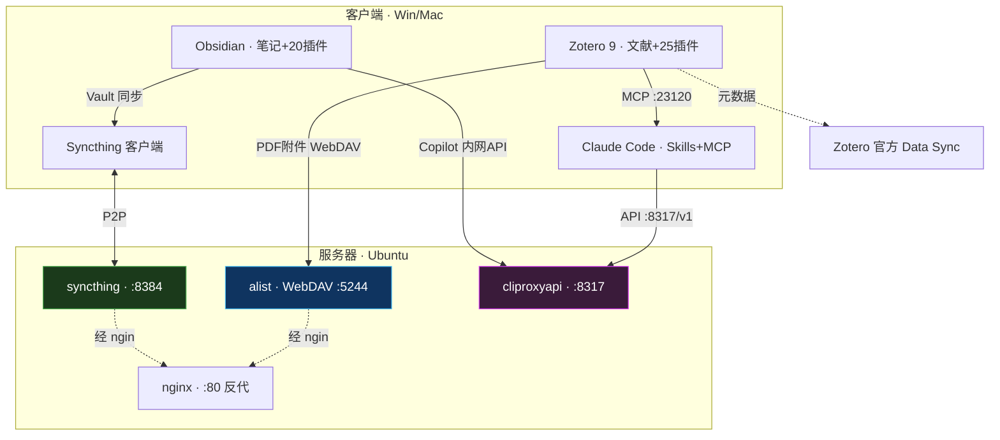

**关键链路**

1. **文献入库**：Zotero + Jasminum（知网/万方/维普抓元数据）+ SciPDF（自动下 PDF）→ PDF 落 alist WebDAV
2. **AI 读论文**：Claude Code 的 paper-analyzer / paper-comic / paper-deck 把论文转成 HTML / 方法图解 / 幻灯片；**Zotero MCP（:23120）** 让 Claude 直接读写整个 Zotero 库（24 个工具）
3. **笔记沉淀**：Zotero Better Notes（标注→笔记）→ **ZotLit**（导入 Obsidian）→ Obsidian 笔记，Templater 模板化、Dataview 查询
4. **知识内化**：Obsidian **Copilot** 接 cliproxyapi 做 Vault 问答；Excalidraw / Canvas 做思维导图
5. **多端同步**：syncthing 同步 Vault + backup；alist WebDAV 同步 Zotero PDF

**踩坑备忘**

- **Templater 必须 2.20.6**（2.23.1 不兼容 Obsidian 1.12.7）
- syncthing `.stignore` 要排除 `.obsidian/workspace.json`（否则多端工作区状态互相覆盖）
- Obsidian Copilot 需设 `_keychainOnly: false` 才能从 `data.json` 读 API Key
- Zotero MCP 端口 **23120**（cookjohn），llm-for-zotero 端口 **23119**，别混
- Scite 插件不兼容 Zotero 9，已弃用
- markitdown MCP 把 docx/pdf 等转 Markdown 喂给 AI

---

## 6. 各服务关系（核心）

### 6.1 服务总览与依赖图

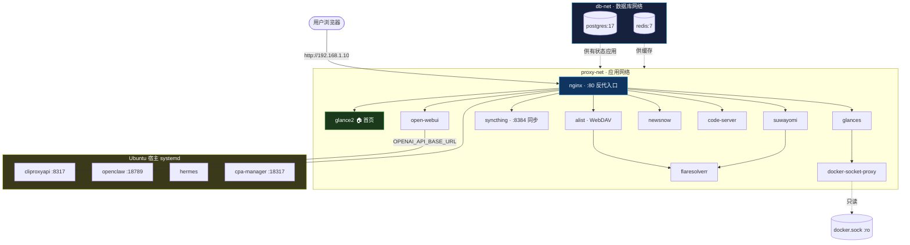

### 6.2 关键依赖链

| 依赖 | 说明 |
|------|------|
| **全部 Web 服务 → nginx** | 唯一入口，通过容器名 DNS 反代 |
| open-webui → cliproxyapi | open-webui 把后端模型 API 指向宿主的 cliproxyapi（AI API 聚合） |
| alist / suwayomi → flaresolverr | 绕过 Cloudflare 5 秒盾 |
| glances → docker-socket-proxy → docker.sock | 监控面板只读访问 Docker 状态，不直挂 socket |
| syncthing · 多端同步 | Obsidian Vault / 数据经 P2P 多端同步，Web UI :8384 经 nginx 反代 |
| alist WebDAV · Zotero 后端 | Zotero PDF 附件存到 alist WebDAV 供跨设备读取（见 5.7） |
| 有状态应用 → postgres / redis | 经 db-net 内部访问，数据库不对外 |

### 6.3 Docker 双网络分层隔离

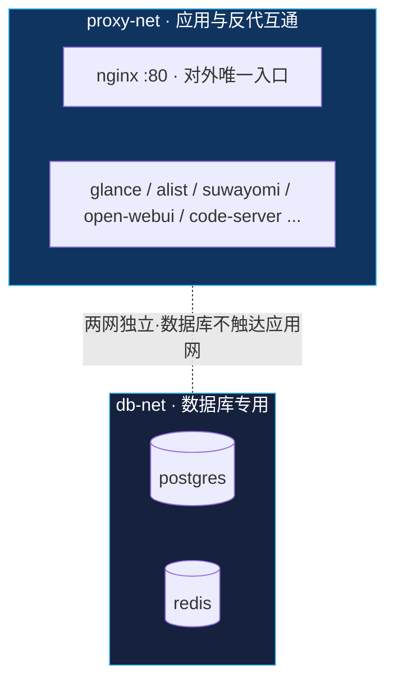

> 设计意图：① 仅 nginx 暴露 80；② 数据库不发布端口；③ 容器重启用 DNS 名通信，不受 IP 变化影响。

---

## 7. 反向代理（核心）

### 7.1 架构决策：为什么把 nginx 放进 Docker

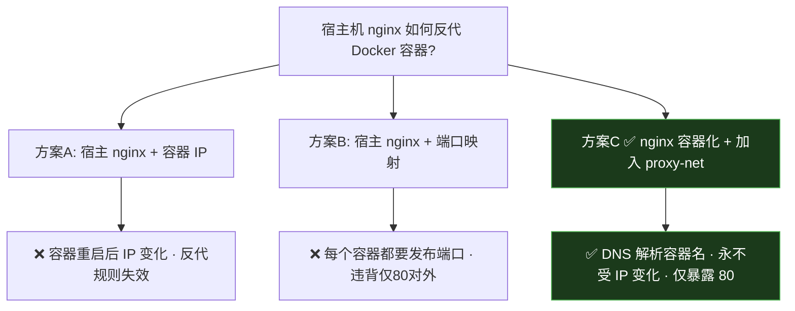

> **nginx 镜像为何本地构建**：若 `nginx:alpine` 在镜像源拉取失败，可用本机已有的 `alpine:latest` + `apk add nginx` 自行构建 `nginx-local`，效果一致。

### 7.2 反向代理路由表

| 路径 | proxy_pass 目标 | 特殊处理 | WebSocket |
|------|----------------|---------|-----------|
| `/` | `glance2:8080/` | 🏠 首页仪表盘（书签/监控卡片） | — |
| `/alist/` | `alist:5244/` | 截断前缀，配合 AList `site_url=/alist` | — |
| `/code/` | `code-server:8443/` | — | ✅ Upgrade |
| `/newsnow/` | `newsnow:4444/` | — | — |
| `/open-webui/` | `open-webui:8080/` | — | ✅ Upgrade |
| `/openclaw/` | `192.168.1.10:18789/` | **宿主机服务**（非容器，用宿主 IP） | — |
| `/syncthing/` | `syncthing:8384/` | Web UI；P2P 同步端口 :22000/:21027 另行放行不走 nginx | — |
| `/suwayomi/` | `suwayomi:4567/` | 漫画阅读器 Web UI | ✅ Upgrade |
| `/glances/` | `glances:61208/` | — | — |

> 每个带子路径的服务都配 `location = /xxx { return 301 /xxx/; }`，做无斜杠→带斜杠跳转。需要大文件上传的（如 alist）额外转发 `Range`/`If-Range` 头并放宽 `client_max_body_size`。

### 7.3 反向代理数据流

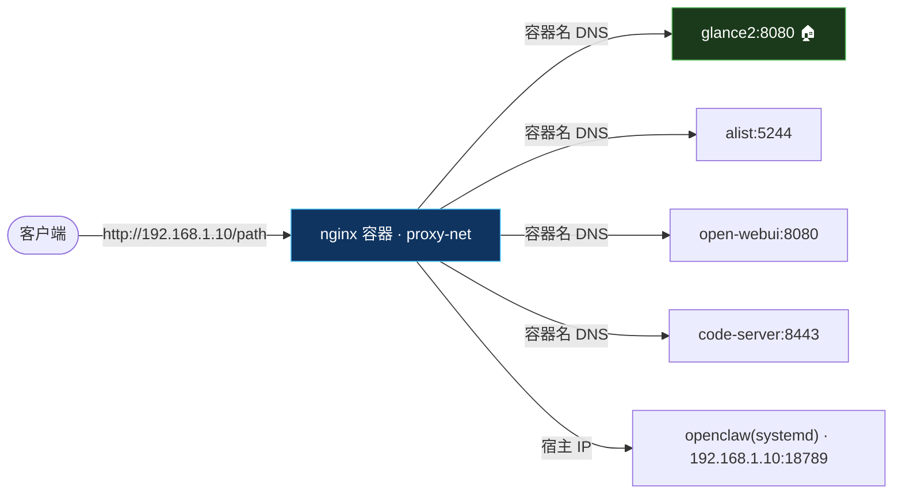

### 7.4 子路径反代的两种模式（重点）

不同应用对「URL 前缀」的处理方式不同，nginx 的 `proxy_pass` 写法必须与之匹配，否则会出现静态资源 404 或重定向循环。

**模式 A — 应用自带 base path（保留前缀）**
应用本身支持配置一个基础路径，nginx 把前缀**原样传给后端**：

```nginx
location /alist/ {
    proxy_pass http://alist:5244/;   # 尾斜杠: 用 / 替换 /alist/
}
```
配合应用侧 `site_url=/alist`，前端生成的链接自带 `/alist` 前缀 → 对外带前缀、对内透明。

**模式 B — 应用不支持子路径**
只能靠 nginx 截断前缀，或改用子域名。截断写法：

```nginx
location /app/ {
    proxy_pass http://app:port/;     # 尾斜杠截掉 /app 前缀
}
```

> **尾斜杠规则速记**：`proxy_pass` 带 URI（带路径/尾斜杠）→ 会替换 location 匹配部分；不带 URI（只有 `host:port`）→ 原样透传完整路径。拿不准时，分别带/不带尾斜杠各测一次静态资源加载，最稳妥。

### 7.5 配置热更新流程

nginx 配置源文件放宿主机版本管理，更新时复制进容器并热重载，无需重建镜像：

```bash
# 1. 宿主机编辑源文件
vi nginx-default.conf
# 2. 复制进容器
docker cp nginx-default.conf nginx:/etc/nginx/http.d/default.conf
# 3. 测试语法 + 热重载（零停机）
docker exec nginx nginx -t && docker exec nginx nginx -s reload
```

---

## 8. 备份与运维

### 8.1 三层备份架构

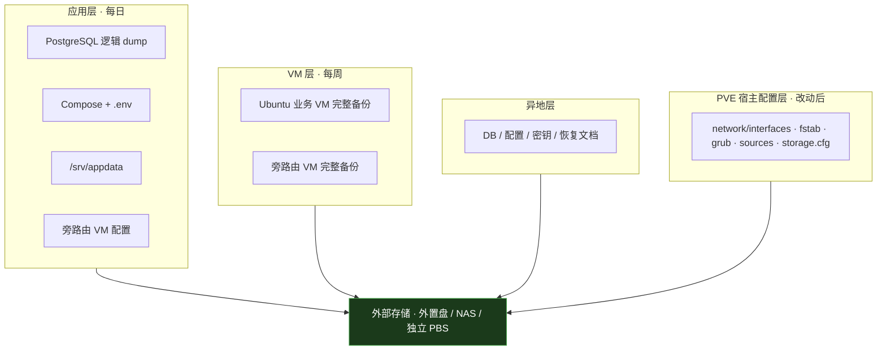

> 🚫 同一块 NVMe 上的 PBS VM 不是灾难恢复副本；`/etc/pve` 是 pmxcfs，**不可在运行态整体覆盖回新系统**。

### 8.2 UPS 与安全关机

UPS 覆盖服务器 + 主路由 + 光猫 + 交换机 + NAS；NUT 客户端装在 PVE 宿主统一编排关机顺序：**业务 VM（含数据库）→ 旁路由 VM → PVE → NAS**。每季度做一次真实拔电停机演练。

### 8.3 快速恢复命令

```bash
# 启动所有非自启容器
docker start $(docker ps -a -q --filter "status=exited")
# 启动主机 systemd 服务
sudo systemctl start cliproxyapi openclaw hermes cpa-manager
```

---

## 9. 经验与避坑清单

| # | 要点 | 说明 |
|---|------|------|
| 1 | nginx 反代务必容器化 | 加入 proxy-net，用 DNS 名通信，避免容器 IP 变化 |
| 2 | docker.sock 不要直挂 | ≈ root 权限，改用 docker-socket-proxy 只读 |
| 3 | 数据库不发布端口 | 仅 db-net 内部访问 |
| 4 | 仅 nginx 暴露 80 | 其余容器走内网，收敛攻击面 |
| 5 | 密钥进 .env | `chmod 600`，不入 Git、不进镜像 |
| 6 | 子路径看应用支持 | 应用带 base path → 保留前缀；不支持 → nginx 截断或换子域名 |
| 7 | /srv 挂载保护 | `RequiresMountsFor=/srv` 防止挂载失败后空写系统盘 |
| 8 | Thin Pool 监控 | 75% 告警 80% 处理，别等 100% |
| 9 | 快照 ≠ 备份 | 必须有异机/外部副本 |
| 10 | 来电自启 | BIOS 设 Restore on AC = Power On |
| 11 | 换源安全更新留官方 | 镜像有同步延迟，安全补丁走官方源 |
| 12 | 配置版本化 | Compose + .env + Git 是唯一真实来源 |
| 13 | syncthing 端口 | Web UI :8384 走 nginx；同步必须放行 P2P :22000/:21027，否则多端连不上 |

---

## 附：架构成熟度

当前架构在「单网口 + CPU 软处理 + 默认存储」下即可稳定上线，已覆盖 DNS 辅助、AI 网关、网盘、阅读、监控、IDE、反代、知识库（文献 + 笔记）等完整业务面。后续可按需逐项启用：VLAN 隔离、10G/25G 高速链路、核显直通（注意 Arrow Lake 平台存在 IOMMU 地址宽度限制，需验证）、Windows VM。**每项改动前备份，改动后做 24 小时稳定性测试。**
